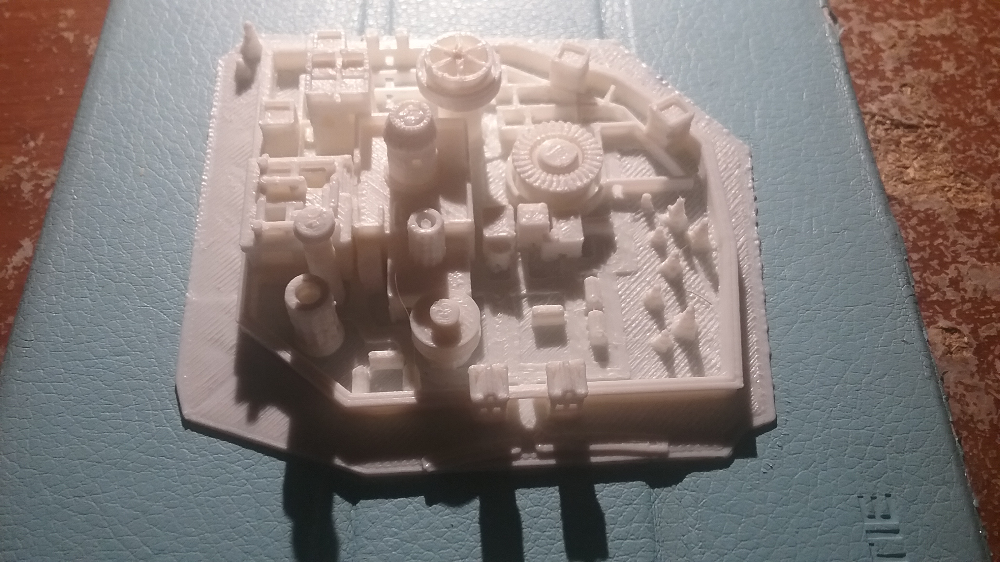
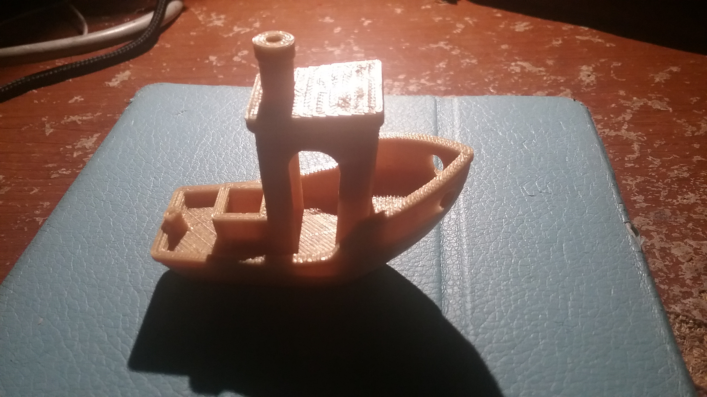
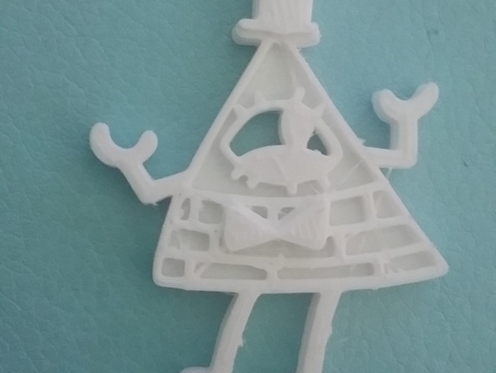
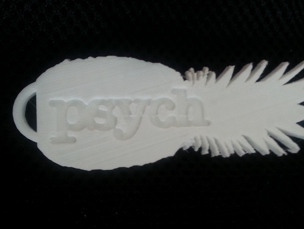
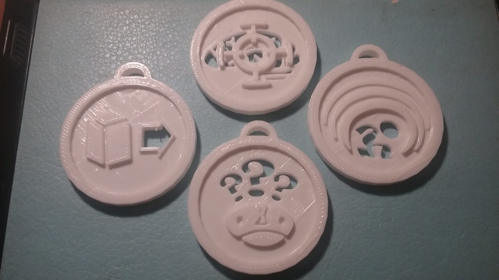
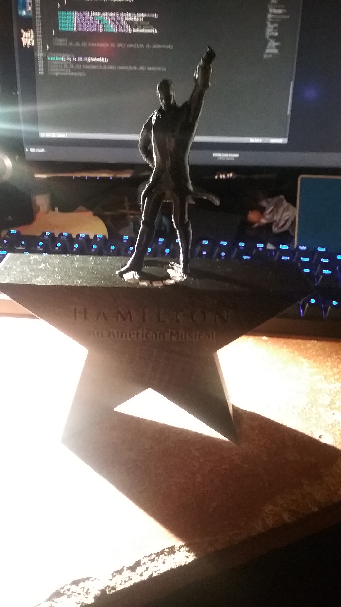

2016 was the year of 3D printing for me. I got a job with 3D printing, I got my own 3D printer, and I started selling my own 3D designs. I thought I'd start off 2017 by making a little post recapping my escapades.

## The Start Of Everything

Before 2016 I had barely heard about 3D printing, just a little bit hear and there. I thought it was a cool new thing but never had the time or money to get into it. But as it turns out 3D printing was going to come to me. I was working a tech support job at my university when they decided to create a new 3D printing lab. Once they had everything up and running they started to look for consultants to work there. Honestly I wasn't even planning on applying but my friend, who was the head of the lab, convinced me to try and get the job. I went home watched some [Tested Videos] to at least give me a grasp of some 3D printing ideas. The quick crash course in 3D printing gave me info insight that I surprisingly got the job. This was the start of my current obsession.

Getting a job in a 3D printing lab was only part of what drove me to get my own printer. The lab I started working in had a knock-off [Pursa i3] printer that they couldn't get running. Since I really enjoy working with electronics and gadgets I used all of my down time to get this printer up and running. After the first day working there I had the printer at least doing something. This was thanks to a [Github repo] the maker of the printer had setup with instructions for the printer.
By the end of my first week I had actually gotten the 3D printer to start printing. I loved working with this cheap D.I.Y. printer! After a month or two of tinkering, celebrating, reloading firmware, breaking thing, fixing things, and lots of googling I was getting pretty good prints. My favorite print from that printer was a model of Winterfell from the Game Of Thrones series.

You can download the file on [Thingiverse][winterfelllink]

## My Own Printer

For my birthday this year I finally got my own printer. I purchased the [MonoPrice Maker Select] which is a relatively cheap (around \$300) entry level printer. This printer was actually a recommended printer from the [3D Printing subreddit]. If you are interested in getting into 3D printing you really can't go wrong with this printer. It prints pretty good straight out of the box and is easy enough to start getting awesome prints from. This is actually a whole lot easier than the printer I helped get working. There are only two parts that need to be screwed together and a few cables that need plugged in. If you end up getting this printer here's a super helpful [guide on the printer].

Here's on of my first prints of [Benchy][benchylink] which is a sort of standard test print.

I then when crazy adding modifications to my printer to make it print better. The two biggest ones anyone should do are the [Z brace mod] and a new [all metal hotend]. I did a few calibration tweaks and added some rubber feet to make it a little quieter. I'm also in the middle of changing the fan because my original one quit working. It's a little janky right now but it works. Here's a picture of my printer as it currently stands.

## Making Cool Things

Now I'm far from an artist. I drew a little bit when I was younger but now days I'm a full on logic person. Even the music I make has more logic then art in it in my opinion. But I've really found a happy balance of creativity and logic with designing things to be 3D printed. When you design something for a 3D printer you have to think about how it will print all the time. The main thing I've been creating this year is keychains. It really started on a whim. I'm a big fan of the YouTuber [Northernlion] and thought it'd be funny to make a keychain of him. I found a program called [OpenSCAD] that uses a programming language to create 3D models. I used this program because I'm super comfortable with programming and it had a function where I can turn 2D images into 3D models. Here was the result of my first design.

You can check out the design on my [Thingiverse][nl thingiverse].

My next design actually went really well. When Pokemon Go came out I decided to make keychains for the 3 teams. These designs turned out really well. At this point I was still using using the 2D to 3D function from [OpenSCAD] which while it does work, it doesn't work very well. This led me to using [Inkscape] and the [Generate OpenSCAD path extension] which made both my keychain making easier and cleaner. This really kick started my keychain making. Here's my Pokemon Go keychains.

You can download them on my [Thingiverse][pokemon go keychain link].

From this point I started making various keychains that I thought would be cool. I turned a Gravity Falls picture my friend drew into a keychain. I've made keychains based on TV shows and games I liked. And I plan on making a lot more keychains in 2017. Here are the various keychains I made in 2016.

Bill Cypher

[Thingiverse Link][bill thingiverse]

Psych Pineapple

[Thingiverse Link][psych thingiverse]

Psychonauts Badges

[Thingiverse Link][psychonauts thingiverse]

Spelunky

[Thingiverse Link][spelunky thingiverse]

Then for this holiday season I tried to stretch my skills by making some presents. I made a spinning ornament and even combined electronics and LED's into a statue thing.

Hamilton Spinning Ornament

[Thingiverse Link][ham ornament thingiverse]

Fallout Hamilton Crossover Statue

[Thingiverse Link][fallout thingiverse]

Hamilton Lightup Statue

## 2017

2016 was a rough year in a lot of ways but I really enjoyed diving in to 3D printing. It was fun learning a little more about 3D printers by modifying my own printer. And I gained new skills by creating my own models to be printed. I even made a bit of money off of selling 3D prints on [Shapeways]. With so many experiences in 3D printing last year I'm looking forward to what 2017 holds. I plan on diving even deeper and doing even more to grow my skills with 3D printing.

I'd love to hear about your thoughts on 3D printing. Is this the first time you've heard of it? Have you been printing awesome stuff for ages now? Feel free to leave a comment below and check back for more musings on 3D printing.

[tested videos]: https://www.youtube.com/watch?v=b0U6LgmB0j4
[pursa i3]: http://www.prusa3d.com
[github repo]: https://github.com/garynmckinney/3DPrinter
[winterfelllink]: http://www.thingiverse.com/thing:39680
[monoprice maker select]: http://www.monoprice.com/product?p_id=13860
[3d printing subreddit]: https://www.reddit.com/r/3Dprinting/
[guide on the printer]: http://3dprinterwiki.info/wiki/wanhao-duplicator-i3/
[benchylink]: http://www.3dbenchy.com
[z brace mod]: http://www.thingiverse.com/thing:921948
[all metal hotend]: http://www.micro-swiss.com/product-page/29551477-6081-c30f-04fe-cece31e3ba6f
[northernlion]: https://www.youtube.com/user/Northernlion
[openscad]: http://www.openscad.org
[nl thingiverse]: http://www.thingiverse.com/thing:1591913
[inkscape]: https://inkscape.org/en/
[generate openscad path extension]: http://www.thingiverse.com/thing:25036
[pokemon go keychain link]: http://www.thingiverse.com/cxsquared/collections/pokemon-go-keychains
[bill thingiverse]: http://www.thingiverse.com/thing:1738493
[psych thingiverse]: http://www.thingiverse.com/thing:1649355
[psychonauts thingiverse]: http://www.thingiverse.com/thing:1940017
[spelunky thingiverse]: http://www.thingiverse.com/thing:1976613
[ham ornament thingiverse]: http://www.thingiverse.com/thing:1935739
[fallout thingiverse]: http://www.thingiverse.com/thing:1976702
[shapeways]: http://www.shapeways.com/shops/nerdy-knickknacks
