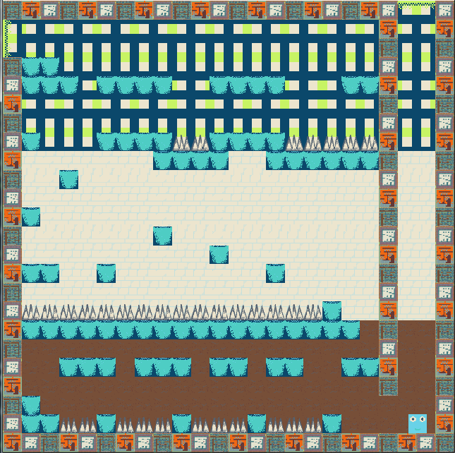

I've finally finished my first ever Ludum Dare! I'm really happy with how it turned out. Down the Rabbit Hole is a simple platformer that uses the previous levels as the tiles for the next level. It's pretty basic but I'm happy with how it all came together. The game was made using [Haxeflixel](haxeflixel.com/), [PyxelEdit](http://pyxeledit.com/) for graphics, and Logic for music.

[PLAY THE GAME!](http://ludumdare.com/compo/ludum-dare-31/?action=preview&uid=23711)

[VIEW THE SOURCE](https://github.com/cxsquared/LD_OneScreen)
