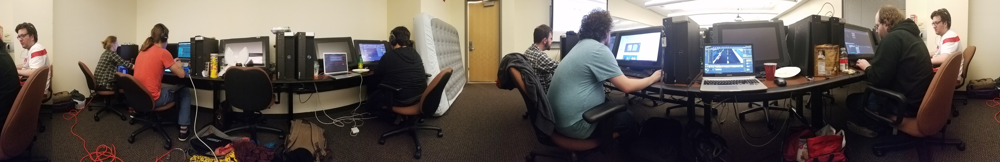

So [Global Game Jam][ggj] just happened last weekend. I didn't have the time to participate all weekend but got a lot of work done on Saturday. Sadly, the team I worked with didn't quite finish because we ran into quite a few issues with [Unreal 4][unreal]. This year's theme was _Waves_ which to me is actually a pretty good theme. This was the first year I've had a super large team. I ended up being on a team with 8 people including me. Overall, while we didn't quite finish, I think we came up with some cool stuff and I discovered a few cool things to do with [Unreal 4][unreal]. But as always I had a great time at [GGJ][ggj] and I'm super glad I got to participate for my 4th year in a row.

When I arrived on Saturday I hopped onto a team that needed some help and got to work. They were creating a sort of endless runner game where the player dodges rain drops and waves as they run along a city street. I wanted to focus more on music for this jam because I wasn't able to stay for the whole weekend. I was actually the second musician on the team so I decided to try and help incorporate the music into the game better. I ended up helping design a system that generated obstacles based on the music track. This was all done using the midi track that was actually used to create the music track.

Here's the track made by my good friend that we based our level on.

<iframe width="100%" height="350" scrolling="no" frameborder="no" src="https://w.soundcloud.com/player/?url=https%3A//api.soundcloud.com/tracks/303940489&amp;auto_play=false&amp;hide_related=false&amp;show_comments=true&amp;show_user=true&amp;show_reposts=false&amp;visual=true"></iframe>

I wasn't sure how well midi would actually work in Unreal 4, but I was lucky enough to find a plug-in called [Procedural Midi][midi] that had already handled all the back end for me. The plug-in allowed me to import a midi track to [Unreal 4][unreal] and send events based on all the midi note data. I did run into a few hiccups when working with the plug-in but I found solutions quickly. The first challenge was lining up the notes with the actual game play. There was too issues with this. First the midi track and the music track needed to start at the same time and at the same time as the game play. This was a simple fix with just adding a delay to either the music track or the midi track to make sure everything lined up. The other problem was setting the proper tempo for the midi. The [midi plug-in][midi] actually uses a speed modifier that is just a float with 1 begin the default. I had to go into the source code on Github to figure out that the default tempo was 120. This allowed me to just set the speed modifier to what ever tempo our song used. The other task I had to figure out was how to use the midi information to create a decently interesting level. At first I just spawned the notes based on a range with a little random padding. This turned out to spread the rain drops way to thin and it just wasn't interesting. So I ended up converting all the midi to just one octave and spawning all the notes that way. Having a 12 note spread create just enough interesting game play for our purpose.

Like I said, sadly we didn't put together a fully playable game. On the last day we could work with [Unreal 4][unreal] well enough to merge all of our art and programming into one project. If Unreal 4 had a little better Git support, a smaller project size, and we all had a little more experience of [Unreal 4][unreal] I think things would have went over a lot better. In the coming weeks I'm still going to try and combine everything to the best of my abilities so that we can actually say we more or less finished.

If you had any experiences with [Global Game Jam][ggj] this year make sure to leave your comments below. Thanks for reading and see you next week.

[ggj]: http://globalgamejam.org/
[unreal]: https://www.unrealengine.com/what-is-unreal-engine-4
[midi]: https://www.unrealengine.com/marketplace/procedural-midi
