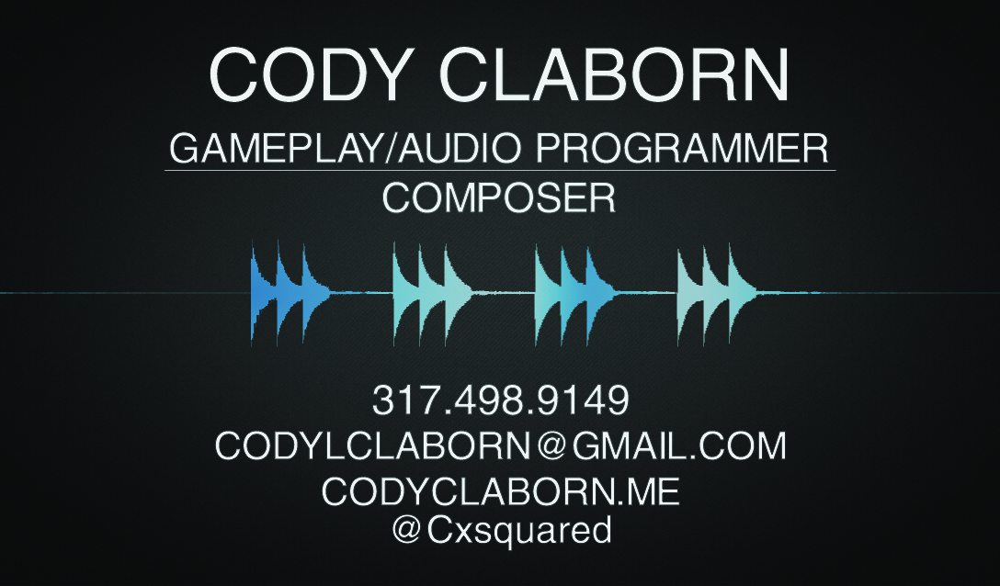

So it's less than a week before this year's Game Developers Conference (GDC) and I can't hold in my excitement. This will be my first time attending GDC, and I couldn't begin to describe how terribly excited I am. Getting the chance to step my foot into the video game industry is beyond amazing. I've already stumbled upon so many wondrous talks and parties that could last a month let alone be shoved into a week. It's overwhelming and perfect and I'm counting down everyday till it arrives.

To top off the experience of just going to GDC I was lucky enough to be chosen as a Conference Associate. This means that I don't only get to see GDC and all it has to offer, but I also get to work and get paid to help with GDC. I will be one of many that are responsible for making sure all the activities at GDC go off without a hitch. With this opportunity I'll get to meet some of the people that make the game industry such an amazing place. To me, it is an honor to be granted the experience of being a Conference Associate.

The time is drawing near when I will take flight and be headed to San Francisco. Days are passing by and counting down and they still aren't moving fast enough. As I'm writing this I can't help but think that this time next week I'll be on a plane heading to the biggest get together of the video game industry. It's a moment that I won't forget and a time that I won't put to waste. I hope to use this experience to take my first step to a career doing what I love.

I'll leave this post with the design of my first business cards that I'll be using heavily during GDC.

If you are going to be at GDC make sure to leave a comment and hopefully we'll run into each other!
