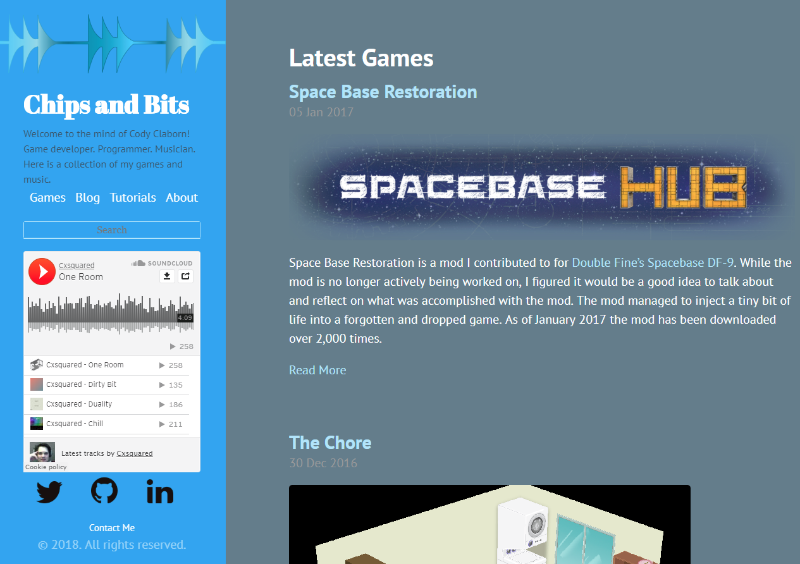

For the past month or so I've been wanting to redo my personal site. I wanted to get back into the habit of writing more posts and my old site was getting very out-dated. I've started doing web development at work so I figure I could put my new skill to use in my personal work. Overall I really enjoy my sites new look and I feel like it's going to be much more manageable to work with it in the future. This post is a recap of some of the reasoning and problems I ran into during the transition.

## Figuring out a new workflow

Previously my site was built using the static site generator [Jekyll]. It is a great system for building static sites but my main problem with it was it's Ruby dependency. I don't have anything against Ruby but it's not something I use everyday so I wanted to move to something I knew better. 

During my search for something new I wanted to stick to a static site generator. I use my own cloud server to host my site, but I don't like having to manage a database or server-side code so I prefer static sites. At work I've been doing a lot of work with [React] so that's the first place I started.

If you don't know [React] is a JavaScript library for user interface development. For me it kinda turns front end development on it's head by having the design be driven by your data directly. [React] uses a component system that generates your HTML structure for you. I typically don't like front end work but I'm quickly falling in love with [React] so I highly recommend you check it out. Here's a great video explaining why React is so cool https://youtu.be/x7cQ3mrcKaY.

After a quick google search with the words: **React** and **Static Site**, I came across [GatsbyJS]. Turns out this is exactly what I was looking for, what they call, a "Blazing-fast static site generator for React". Even better was the fact they use [GraphQL] queries to pass data around to React Components. A quick glance through the documentation let me know this was going to be the new solution to my website.

## Thinking about the design

Besides my existing posts I was going to start this new site from scratch. I no longer enjoyed the look and feel of my old website so I went all in on the new one. I mean let's be real, my old site was really bad...

I started out searching around for some development blogs that I liked the look and feel of. Here are the ones I ended up taking inspiration from:
* [https://www.joelonsoftware.com/](https://www.joelonsoftware.com/)
* [https://blog.fedecarg.com/](https://blog.fedecarg.com/)
* [https://www.funtoo.org/Awk_by_Example,_Part_1](https://www.funtoo.org/Awk_by_Example,_Part_1)

I liked bits and pieces from each of these sites and wanted to incorporate them into my site. I did a bit of sketching out my ideas. Once I had a general style down I went straight into making my index/home page. I figured this page would be the best one to start on to get my header, footer, and about sidebar all working. For the most part my design ebbed and flowed while I was writing code. [React] is really nice at being flexible mid design and allows you to be super creative design wise from within your code.

For me  the most useful tools design wise were [flexbox](https://www.w3schools.com/Css/css3_flexbox.asp) and [grid](https://www.w3schools.com/css/css_grid.asp). These CSS tools make it very easy to make responsive web pages. When combined with [React] it's crazy easy to make sure your web page looks good on desktop and mobile. If you want to learn more about flexbox or grid I highly recommend [Scrimba](https://scrimba.com/). It's a completely different learning experience with really great web front end tutorials. Another great design tool is inline CSS. With React inline CSS makes it so much easier to style things rather than worrying about classes, ids, and selectors.

## The transition process

Once I had most of my looks figured out I need to start putting data into my site. Like [Jekyll], [GatsbyJS] can use markdown files for your posts. Since this was the same I was hopping it would be really easy to just transfer all my existing posts to [GatsbyJS]. For the most part this was true. To start getting my data and posts into [GatsbyJS] I needed to learn more about how [GatsbyJS] works. So I started out with [Gatsby's tutorials](https://www.gatsbyjs.org/tutorial/). The tutorials are a great starting point to wrap your mind around how [GatsbyJS] generates your pages and leverages [GraphQL] to make things really easy. After going through those I had good idea how they handled my markdown files and generated pages. 

The majority of tasks can be made a lot easier in [GatsbyJS] using plugins. These plugins can do everything from helping generate extra data for your pages to providing tools for easier [React] development. I used a number of them to handle favicons, my sitemap.xml, dynamic images, and even my generating html for [Matomo](https://matomo.org/) the analytics tool I use. You can check out a list of my plugins on [Github](https://github.com/cxsquared/portfolio-v3/blob/master/gatsby-config.js). 

I did have to clean up my markdown files from [Jekyll] both for general cleanup and for use in [GatsbyJS]. I updated the file names to remove the date from the title and instead put the publish date in the frontmatter. Also instead of just having the mardown file [GatsbyJS] is more designed to have a folder with the post title and an index markdown file. It's also nice because you can include your images in the folder with the index markdown which I find allows for better asset management. Besides a little clean up getting my data into [GatsbyJS] from [Jekyll] was super easy.

On a side note, to help me clean up my posts I found a great tool called [StackEdit](https://stackedit.io/) which is an online markdown editor. The only downside to static sites is you don't have a dedicated post editor but [StackEdit](https://stackedit.io/) alleviates this problem and has helped me organize my thoughts a lot better.

## Finally live

For me [GatsbyJS] is the static site generator I've been looking for all along. [React] makes me actually like frontend development. Things like inline CSS with [glamor](https://github.com/threepointone/glamor) and [React]'s component based system make designing a site easier and quicker than before. I feel like this is a major upgrade and if you've seen my old site I hope this is a welcome upgrade for you.

Thanks for reading about my journey with my new site. If you have any comments or thoughts feel free to post them bellow.

[Jekyll]:https://jekyllrb.com/
[React]:https://reactjs.org/
[GatsbyJS]:https://www.gatsbyjs.org/
[GraphQL]:https://graphql.org/
