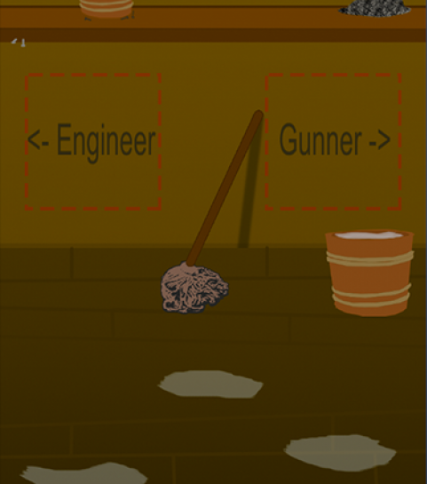

You can check out the game at [GlobalGameJam.org](http://globalgamejam.org/2015/games/pirate-panic) and check out the people that helped make the game [Tim](https://twitter.com/Drayfe),  [Josh](https://twitter.com/cwi_josh), and [Geoff](http://thehibberts.us/geoff/).

This year was my second Global Game Jam and I really wanted to do things a lot different from the first year. Since last year I've  participated in several game jams and have grown enormously as a developer. I felt this growth has given me the confidence and knowledge to do new and different things and that's what I did.

* * *

**Pirate Panic!**

Pirate Panic! is a multiplayer pirate combat experience. Five people each take control of a different role on a ship. You have you captain, the organizer of the group who is the only one who can see the map and the enemies. Then there's the pilot who controls the direction and speed of the ship. The gunner who loads and fires the cannon. The engineer who plugs the hole in the ship and empties the ever increasing water slowing everyone else down. And finally the lonely cabin boy who distributes supplies to the rest of the crew and keeps the ship nice and clean. They must work together communicating and yelling at one another to go destroy the enemy.

* * *

**Goals...**

To me GGJ is all about meeting new people, making new connections, and learning new things. My biggest goal for this year was to meet new people. Last year I went to GGJ with a predetermined team. While I think this was great for my first ever game jam, you gain a lot more from finding a team at the jam. Not going in with a team really increased my gain in knowledge and connections. I met awesome people and learned so much from them in such a short time.

* * *

**What Went Right...**

The first thing my team did before any programming start was plan out a solid idea. We spent about two hours just planning out what the game was going to be. I believe this two hours of extra planning saved us hours of headache in the end. The best tool for our planning was a white board we could jot our ideas down. The board allowed us to iterate quickly through ideas till we came up with a solid plan that we thought was do able in 48 hours.

Splitting up the work actually proved to be very simple and efficient. The way we designed the game let us easily split the work between our four programmers. One of us took on the networking side of everything and the rest of us took a screen and started working on it. Each screen was basically it's own mini-game which let us all work individually. This let us get lots of work done fairly quickly.

* * *

**What Went Wrong...**

Our biggest struggle was combining all the screens and passing data back-and-forth between them. While we planned out each mini-game quite well we didn't really plan on how the mini-games would interact. The basics of firing and moving where fairly simple to add but the finer details of how each screen would affect the other was a lot harder to plan. We had ideas on how the screens beyond movement would work but never really got around to making them matter.

We tried our hardest to manage our time well but we had to work down till the last possible minute. I wanted really to push myself this jam and that I did. The game's scope was probably a little large but we did manage to get the game mostly working in the end. I was super proud of what we had thrown together.

* * *

**Final Thoughts...**

I went into this year's Global Game Jam wanting to meet new people and really push myself and that's just what I did. In the end my team had a really fun game concept and produced a pretty playable prototype. We went big and made something that was pretty fun. I accomplished all that I set out to do and I can't wait for next year. I invite anyone and everyone to go to Global Game Jam next year and I promise you won't regret it.
