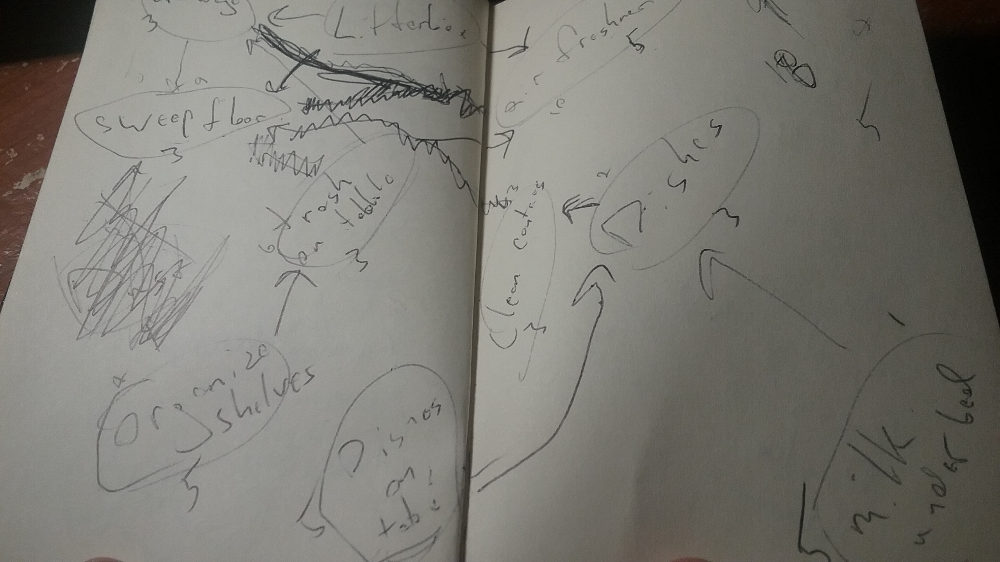
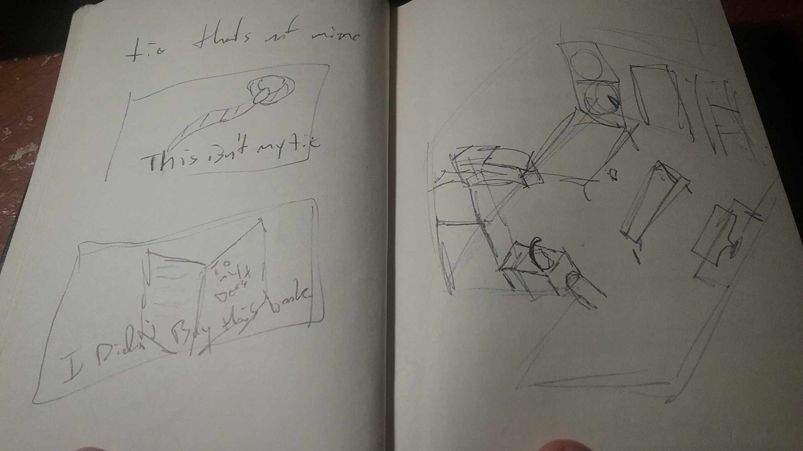
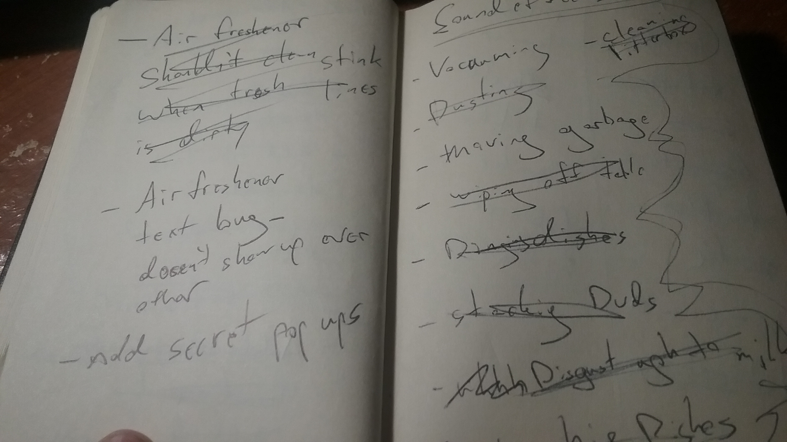
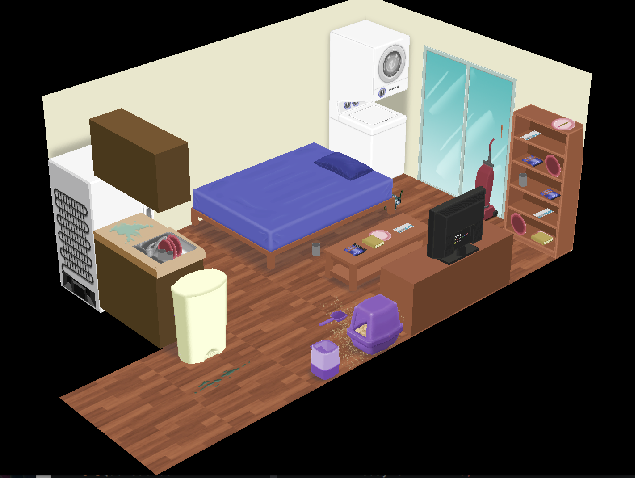

**The Chore** is a sequence puzzle game about cleaning a room with a dark twist. This was my 4th Ludum Dare but my first time joining the Jam instead of the Compo. I, [@Cxsquared](https://twitter.com/cxsquared), was lucky enough to have my good friend [@Moussetticus](https://twitter.com/Moussetticus) handling all the art and some of the design with me. I covered all the programming and audio for the game. Together we are pretty happy with how our game turned out. Feel free to play our game over here and if you are interested in the process feel free to read on.

## Things Used

* [HaxeFlixel](http://haxeflixel.com/)
* [Abelton Live](https://www.ableton.com/en/)
* [Maya](http://www.autodesk.com/products/maya/overview)
* [3D Coat](http://3dcoat.com/home/)

# The TLDR

## What Went Right

* Using a JSON actor system instead of a hard coded system allowed me to quickly implement final art and tweaks in a little over an hour.
* I was really happy with how the sound effects turned out.
* Adding a small bit of story seemed to make our game more interesting/replayable even though the game isn’t that interesting.
* The initial idea, even though it was content heavy, was more or less fully realized.

## What Went Wrong

* Couldn’t get animations to render and export correctly from Maya.
* Forgot about a timer feature (we should really write things down more.)
* Didn’t  plan the time out well enough to model 100% of what we wanted.
* Didn’t include enough visual feedback for the actions in game.
* Lack of understanding of the game idea between us. Took till the second day for us to fully agree on the direction and game play.

# The Full Version

## Day 1

So coming into this jam there was one thing I didn’t want to happen, and like all good moments in life, that exact thing happened. I really really really didn’t theme “One Room”. This was mostly because I hadn’t enjoyed the previous Ludum Dares that included number restrictions in the theme. But alas, that’s the theme that happened and we were prepared to roll with it.

Once the theme was announced we began brainstorming. The first thing that popped into our minds was using a chat room for the game. We messed around with the idea of making a multiplayer “hacking” game, a platformer with text, or a social espionage game. The idea’s where decent but we were running into to many design issues. We needed to expand our ideas. This led to us thinking of games that reminded us of the “One Room” theme. Our minds went to old flash games we liked. Which after 3 hours of brainstorming led us to our final idea of a growth/sequence puzzle game. This was inspired by the GROW games on [Eyemaze.com](http://www.eyezmaze.com/). The only downfall to this idea was that it’s very content heavy but since we had a dedicated artist we decided to go head on with this concept.

After the next hour we had a solid idea of what the game flow was going to be. Well mostly. We had jotted down a messy flowchart of interactions for our cleaning mechanic. The next step was getting some temp art so we could get a solid game prototype done as fast as possible. Frank pumped out rough sketches of all the objects needed. And I got a start on the basic mechanics of the game. By this point is was pretty late and having a solid base we decided to call it a night.

## Day 2

The second day was mostly just work, work, work. This day was broad strokes of getting the base of the game created. When we decided the only input in the game was going to be the mouse it made my job as a programmer a lot easier. I had previously created an “actor component” system for some previous work and I knew this would be the perfect starting point. The main thing to this system is using JSON to create actors instead of hard coding them. On top of these actors I create components that I try to make a general as possible to allow for interactions with these actors. So I created a striped down version of this idea and by nightfall I had the actors with simple interaction into the game. The main portion of my time was spent placing all the individual actors in the correct location.I found out that the game framework I was using, [HaxeFlixel](http://haxeflixel.com/), actually allowed me to move actors around and this is what I used to get locations for actors. I blame the fact I was having allergic fits due to being around cats for not just using the reference image to find the correct locations. For the more back-end stuff such as text management and global states I used singletons. This was a functional but somewhat haphazardly approach to this. I’m sure there is a better way for all this but it was quicker for me to do what I already knew. By the end of the night I had all the temp art in with a few working aspects already done.

## Day 3

The start of the third day was spent getting the game fully playable. Thanks to my “actor component” system adding in functionality was quite simple. All of the simple items could be controlled with just one class which played certain animations when clicked. For anything more complicated I just had to extend that class and use the functions I had set up to add more functionality. I’m really happy with how simple and quick these concepts worked. By dinner time I had a fully playable prototype with the temp art. Things were shaping up nicely.

At this time I need a bit of a break from coding. I took the a break from the code and worked on the music. Our game is about cleaning… which is pretty boring. To compliment this I wanted to create a track that was peaceful and smooth. I decided on a jazzy feeling track. I laid down some jazzy piano chords, created a basic drum track with a jazz brushes kit, and then soloed over it with a brassy lead. It’s a really basic track but I think blends well with the visuals and game play feel.

Now with all of that done I wanted to start working on some polish for the game. These little things will hopefully make our game stand out a bit. I didn’t want the game to just be game play because truthfully the game play isn’t that engaging. To fix this I wanted to add a small story. This is as simple as adding a few lines of text and slapping on a vague quote at the end. The quote at the end is what I think really nails home the feeling of the game. While I did choose it based on some rough theme I mainly wanted a vague quote where the player could impart their own ideas about what the game is really about. The game is clearly about one subject but the outcome and take away from that subject can vary based on a few different endings in our game. The craziest thing to me was that people found the different endings without me even telling them there were any. I think this little bit of text makes the game 100% more interesting.

Creating the text system was fun for me. I used another singleton pattern class to control everything. The fun part for me was implementing a queue for multiple lines. Creating the text fade in and out with tweens gives it a sense of polish and attention with very little work. It’s these little things that I hope give our game a little something more than just a 48 hour game about clicking.

## Day 4

Having the extra 24 hours in the jam is so nice. I’m used to the 48 hours in compo that I was willing to stretch the scope of our game just a bit. The last day was full of last minute additions and polish. My main task on the last day was getting all the sound effects recorded, edited, and implemented. I first took on the task in implementing sound because if I couldn’t get that done in time it was pointless to record the sounds. Luckily [HaxeFlixel](http://haxeflixel.com/) makes this super easy. Once that was done I then ran around my house with a microphone recording all the things I needed. The weirdest of which involved me taking out my trash with a microphone in my mouth. Overall I’m super happy with how all the sounds turned out.

In the last two hours the final art was finally textured and finished. I rushed to add in all the final art work. At this point I had discovered the brilliant idea of just using the reference material to place the actors in the game. This made adding the art fairly painless. In the end we even had time to make a fun little title screen with art which just point a cherry on the top of our game. Overall we are really happy with what we’ve created and we hope you like it.

If you have any questions about the programming, music, or art make sure to leave a comment and we'll do our best to respond. If you haven't already head over to our [LD page to play the game](http://ludumdare.com/compo/ludum-dare-37/?action=preview&uid=23711).

