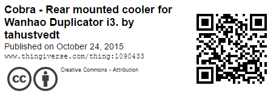
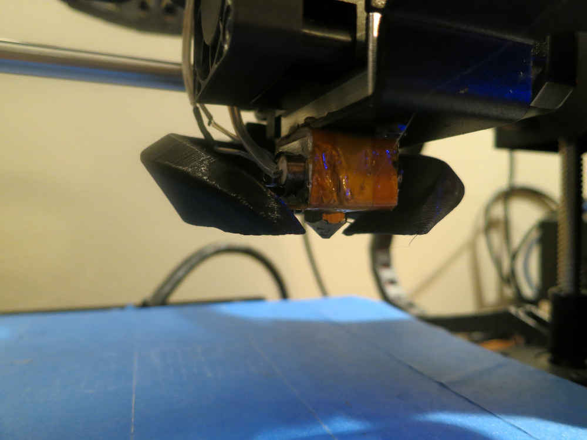

This weeks 3D print was a much needed fan upgrade for my printer. There are a lot of fan mounts out there for the [Wanhao][wanhao] style printer. I went with the [Cobra - Rear mounted cooler][thingiverse] because of it's looks and placement on the printer. You can check out the .STL and other files over at [Thingiverse.com/thing:1090433][thingiverse].

Almost all tutorials and forums will tell you that upgrading your fan is one of the most important things to do with the [Wanhao i3][wanhao] style printer. I have the [Monoprice Makerselect][makerselect] printer which is just a re-skin of the [Wanhao i3][wanhao]. If you check out [Thingiverse][thingLink] you'll see a few different and popular fan mounts for this style of printer. The most popular is the [DiiiCooler](http://www.thingiverse.com/thing:1025471) which I did try but wasn't a fan of because it covers so much of the nozzle head. Instead I chose to go with the [Cobra - Rear mounted cooler][thingiverse]. It's both good looking and gives you a nice clear view of the nozzle head while printing. Since I try and record time-lapses of a lot of my prints I really like having a better view of the nozzle while it's printing. I also already had the screws for this mount which was nice. I tried a few other mounts but they needed fairly long screws which I didn't have.

The real upgrade in this print is getting a better fan. The [Monoprice Makerselect][makerselect] comes with a pretty wimpy fan and a mount that doesn't even really point towards the nozzle. Almost all of the popular mounts use a radial fan which produces quite a lot of blowing power and is pretty quiet. I just purchased a decently prices fan off of [Amazon](https://www.amazon.com/gp/product/B00H6VM83I/ref=oh_aui_search_detailpage?ie=UTF8&psc=1). This fan should work for almost all the popular fan mounts on [Thingiverse][thingLink]. When mounting the new fan it's important to make sure you match the wire colors when plugging it in or you could fry your fan. Overall I'm really happy with this upgrade and it's increased the quality of my prints especially when it comes overhanging areas. Here's a time-lapse of the mount being printed.

<iframe width="560" height="315" src="https://www.youtube.com/embed/Yo8JGvpMMv0" frameborder="0" allowfullscreen></iframe>

If you have any questions or suggestions for things to print in the future feel free to comment bellow.

[wanhao]: http://wanhaousa.com/
[thingiverse]: http://www.thingiverse.com/thing:1090433
[makerselect]: https://www.monoprice.com/product?p_id=13860
[thingLink]: http://www.thingiverse.com/
