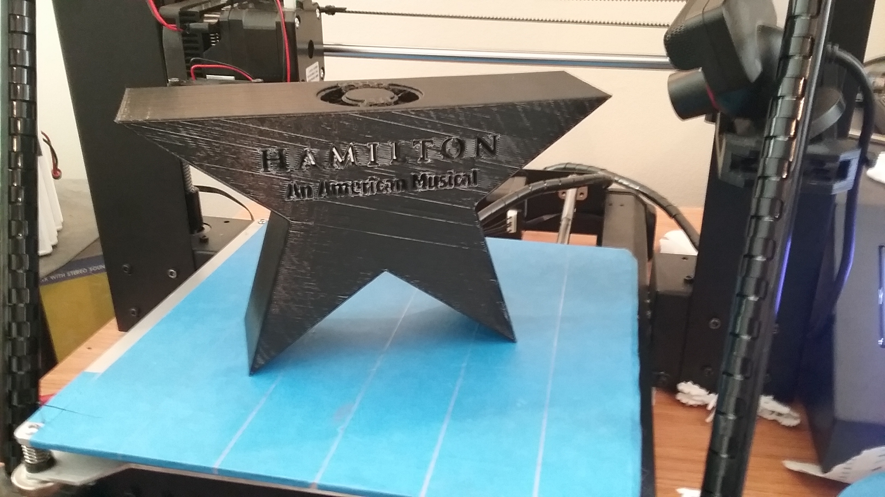
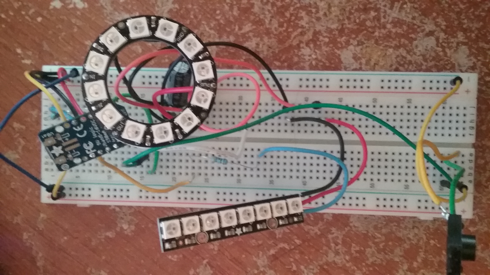
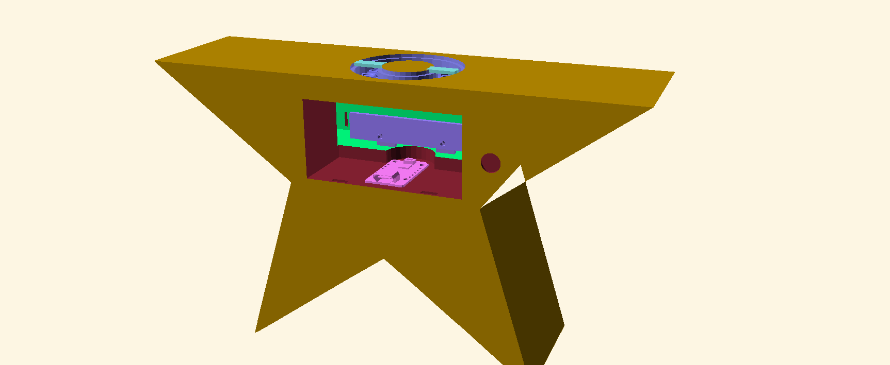
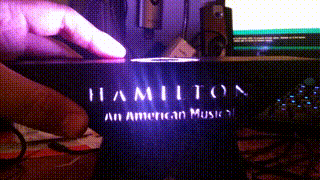
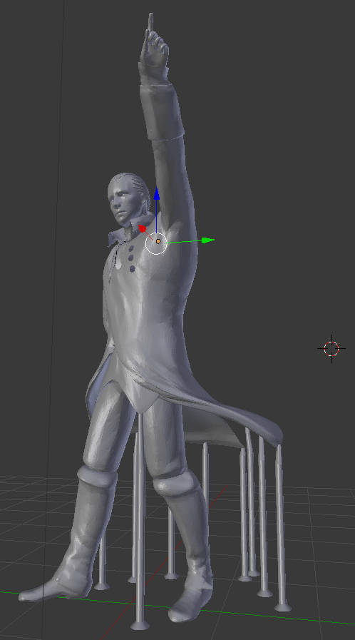
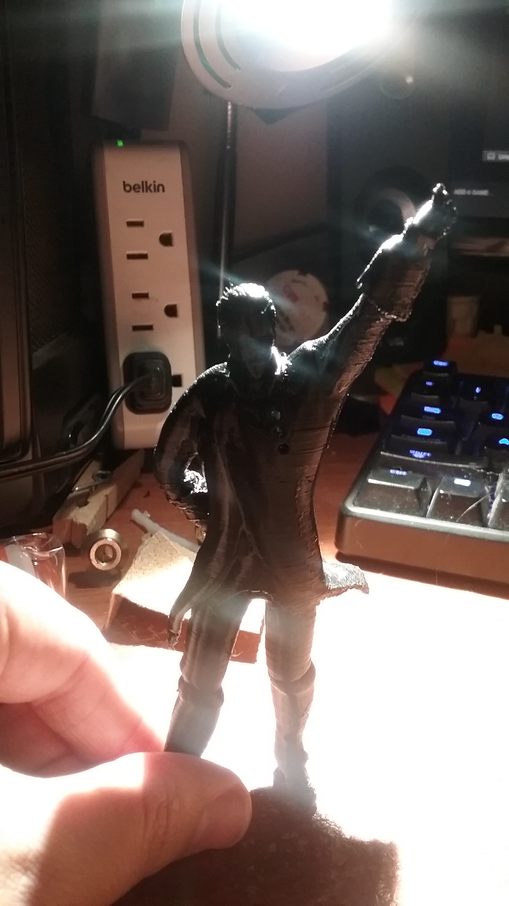
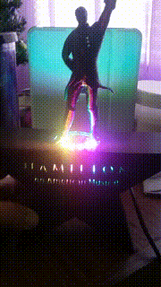

This weeks 3D printing project is actually a recap of a present I created during the holidays. My significant other is a huge fan of the Broadway play Hamilton, and I thought the logo would make for an awesome statue. <!-- excerpt -->

Since this was a present I didn't just want to take the 2D logo and extrude it. I wanted to make something bigger and better. So I started sketching up ideas and decided to add some LED lights. Here's a little explanation of the separate steps I took in creating the end product.

## Parts

This build was my first 3D print that uses electronics. Here's what I used:

- [NeoPixel Stick][neopixelstrip]
- [NeoPixel Ring][neopixelring]
- [Adafruit Trinket][trinket]
- Push Button
- 470 Ohm Resistor x2
- 1000 µF Capacitor

## Base

This was actually the easiest part of the build but took the most time to design. I started out by sketching my ideas out on paper first. I decided on having a strip of LEDs behind the text and a ring of LEDs lighting up the top of the statue. For the LEDs I decided on using [NeoPixels from Adafruit](https://www.adafruit.com/category/168). NeoPixels are strips of LEDs that have built in drivers so that they are super easy to control. Luckily for me they had a [Stick][neopixelstrip] and a [Ring][neopixelring] version that fit my needs really well. I wanted something small and compact to drive the LEDs so I used and [Adafruit Trinket][trinket] which is just a small Arduino. I used the [NeoPixel Überguide](https://learn.adafruit.com/adafruit-neopixel-uberguide/overview) for wiring up all the components together using some resistors and capacitors based on their recommended best practices. For the programming I just used AdaFruits NeoPixel library and [this guide](https://learn.adafruit.com/multi-tasking-the-arduino-part-3/overview) for controlling the two strips I would be using asynchronously. In the end I used 98% of the Trinkets memory but it was well worth it. I just used a breadboard to test everything. Here is a picture of my testing setup.

Now that I had my components together I could start working on how they would fit inside the base. To model the base for printing I used a mixture of [Inkscape][inkscape] and [OpenScad][openscad]. [Inkscape][inkscape] was used to create a path that I could covert to use inside of [OpenScad][openscad]. Then all the heavy lifting was done inside of [OpenScad]. I was lucky enough to actually find some models for the [trinket][trinketmodel] and [ring][ringmodel] that made designing everything easier. The whole process was just cutting a hole out of the back of the star and creating mounting points for the NeoPixels. Here's a little preview of the model in [OpenScad][openscad] with the component placeholders for reference.

I did have one trouble area though. The spot for the bush button was the right dimensions but the hole wasn't deep enough to actually put the button in so I ended up having to cut off some of my print to actually fit the button in. If the print wasn't so big I would have probably went back and printed another one with the button fix but it ended up not looking to bad so I kept it. After I printed the base, which took around 24 hours, I started to install all the electronics. I screwed in the NeoPixels, soldered all the wires up and attached the trinket with some double-sided tape. Here's the final base with all the lights going. There are six patterns in all but one of then is an off state.

## Figure

At the start of this project I knew I didn't just want a 2D version of the top of the logo but a full 3D model. But I don't really have any model experience so I wasn't entirely sure how I was going to pull this off. Luckily I have a friend, [@Moussetticus](https://twitter.com/Moussetticus), who is an awesome 3D modeler so I went to him for help. We ended up looking for an already created revolutionary model. This wasn't the easiest task but we ended up finding one through lots of searching. The model ended up actually being a character from the 3rd Assassin's Creed game but it was close enough that I was fine with it. The biggest problem was that it wasn't the cleanest model. There were a lot of random pieces and all the parts weren't connect. My friend cleaned up the model, modified it to look more like Hamilton, and posed it for me.

Now that I had the model I had the task of actually printing it. This proved to be a lot more troublesome than I had hoped. It didn't want to print well because there were a lot of small over-hanging parts. I tried using [MeshMixer][meshmixer] but the supports it generated just didn't work out for me. I ended up building some of my own supports in [Blender][blender] by creating small cylinders. I widened the cylinders where they connected to the floor and tapered them where they connected to the model. What I finally had to do was use my built in supports and the supports generated by [Cura][cura] to get the model to finally print cleanly. But I am really happy with how the print came out.

## Final Touches

To finish of the statue all I need to print was the back plate. I thought I had designed the back plate to the right dimensions but I was a little off. The clasp I had included was a little to high up and the whole back plate was a little tall but with some forcing I finally got it to fit more or less. This is the one thing I wish I would have went back and fixed. Then I had to attach the figure to the actual base. I messed around with it for a while before finally deciding on printing out two tiny feet plats that fit inside the lip of the NeoPixel ring holder. This print only took around 5 minutes which is probably my shortest print ever. The feet plate fit perfectly and I glued the figure onto the base. Now the only thing left was to try it out. The trinket was powered by a standard micro-usb charger that is normally used for a phone so I plugged it in and here are the results.

## Time-Lapse

<iframe width="560" height="315" src="https://www.youtube.com/embed/T4Lil7l_px0" frameborder="0" allowfullscreen></iframe>

If you have any questions or suggestions for things to print in the future feel free to comment bellow.

[neopixelstrip]: https://www.adafruit.com/products/1426
[neopixelring]: https://www.adafruit.com/products/1643
[trinket]: https://www.adafruit.com/product/1501
[openscad]: http://www.openscad.org/
[inkscape]: https://inkscape.org/en/
[trinketmodel]: https://grabcad.com/library/3v-adafruit-trinket-w-soldered-jst-port-1
[ringmodel]: https://grabcad.com/library/adafruit-neopixel-ring-12x-ws2812-rgb-leds-1
[meshmixer]: http://www.meshmixer.com/
[blender]: https://www.blender.org/
[cura]: https://ultimaker.com/en/products/cura-software
[timelapse]: https://youtu.be/T4Lil7l_px0
