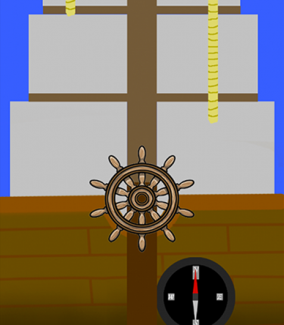
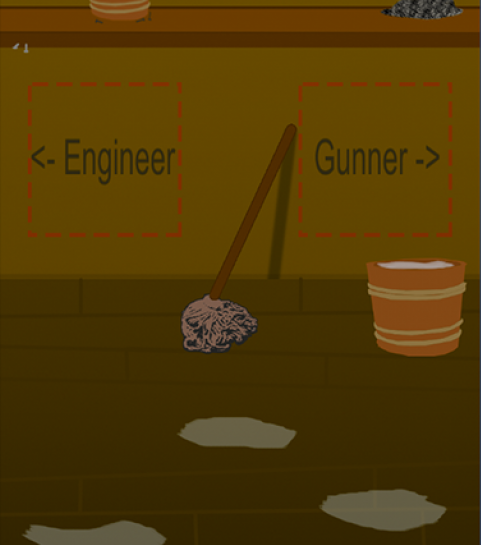

Pirate Panic! is a multiplayer [Spaceteam](http://www.sleepingbeastgames.com/spaceteam/) inspired game built during the 2015 [Global Game Jam](http://globalgamejam.org) in 48 hours. I was a gameplay programmer on the project. You can checkout the game out on the [Pirate Panic Global Game Jam page](http://globalgamejam.org/2015/games/pirate-panic). You can also read my Post Modem [here on my blog]({{ site.baseurl }}).

The game is played with up to 5 people each using either a computer or phone. At the start of the game each player gets a unique screen/role or either the Captain, Gunner, Cabin Boy, Pilot, or Engineer. Each screen has a specific task that must be done in tandem with the other roles. The captain is the only one who can see the map, the pilot controls the ship, the gunner fires the cannons, the engineer fixes the ship when it's damaged, and the cabin boy gives supplies to the gunner and engineer. The goal of the game is just to go around and sink enemies.

I worked in [Unity](https://unity3d.com) with a team of three, [Tim](https://twitter.com/Drayfe), [Josh](https://twitter.com/cwi_josh), and [Geoff](http://thehibberts.us/geoff/). I was tasked with programming the gameplay of the Cabin and Engineer screens. The hardest part of the programming was getting good touch controls working for mobile. I'm really happy that we completed a mostly finished game in the final minutes of the jam.

You can download the game and check it out on the [Pirate Panic Global Game Jam page](http://globalgamejam.org/2015/games/pirate-panic). You can also read my Post Modem [here on my blog]({{ site.baseurl }}).
