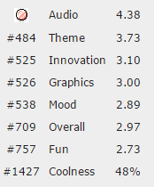

Duality is my entry into the 34 Ludum Dare compo. The game was ranked 3rd in audio in the compo. You can listen to the track on my [SoundCloud](https://soundcloud.com/cxsquared/duality). It's a rhythm based skill game where you have to click the right mouse buttons on the right target. The game was made in 48 hours using [HaxeFlixel](http://haxeflixel.com/) for the game and [Abelton Live 9](https://www.ableton.com/) for the music. You can play the most recent version by reading more or checkout my original version on the [Ludum Dare page](http://ludumdare.com/compo/ludum-dare-34/?action=preview&uid=23711). You can also checkout the source on my [GitHub](https://github.com/cxsquared/LD34).

### My Entry

The theme was Growth/Two Buttons

Duality was my first attempt at creating a timing based game. To achieve this I created a simple text data format that had information on the location, type, and time of each target. I parsed this file to create my level. I always enjoy creating tools that allow me to add more content without having to touch my code to prevent bugs from arising.

I would like to create a visual tool to help making levels a lot quicker. I need a better way to line up the music with the targets rather than using time. Creating some code that converts time into BPM to sync up the level better would have been a good idea.

Here are my final judging results...

#### Soundtrack

<iframe width="100%" height="166" scrolling="no" frameborder="no" src="https://w.soundcloud.com/player/?url=https%3A//api.soundcloud.com/tracks/237334316&amp;color=ff5500&amp;auto_play=false&amp;hide_related=false&amp;show_comments=true&amp;show_user=true&amp;show_reposts=false"></iframe>

You can check out the original version on my [Ludum Dare page](http://ludumdare.com/compo/ludum-dare-34/?action=preview&uid=23711) and you can also checkout the source on my [GitHub](https://github.com/cxsquared/LD34).
