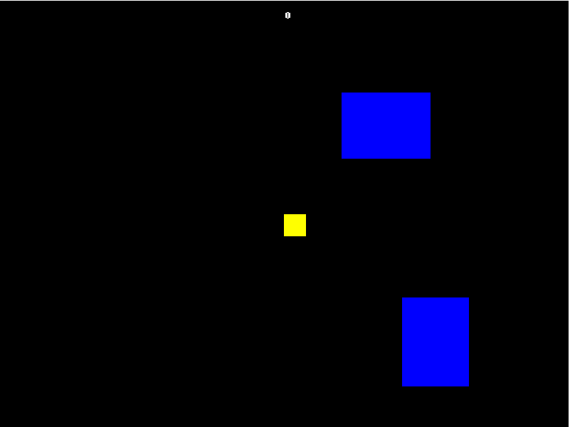
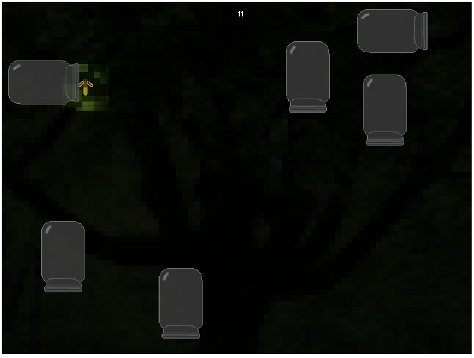

Fireflies was a game built in 1 hour during the [0 Hour Game Jame](0hgame.eu). I just wanted to see what I could do in one hour and make a really quick prototype. The game is a simple avoidance game built with [Haxeflixel](http://haxeflixel.com/). You can play it by clicking read more or view the source over on my [Github](https://github.com/cxsquared/Firefly-0hgame)!

### Original

This was the original game that was built in just 1 hour.

### Improved

I spent an hour to improve the graphics just to experiment a bit.

The experience was fun and quite silly to try and create anything working in an 1 hour at 2 in the morning.
