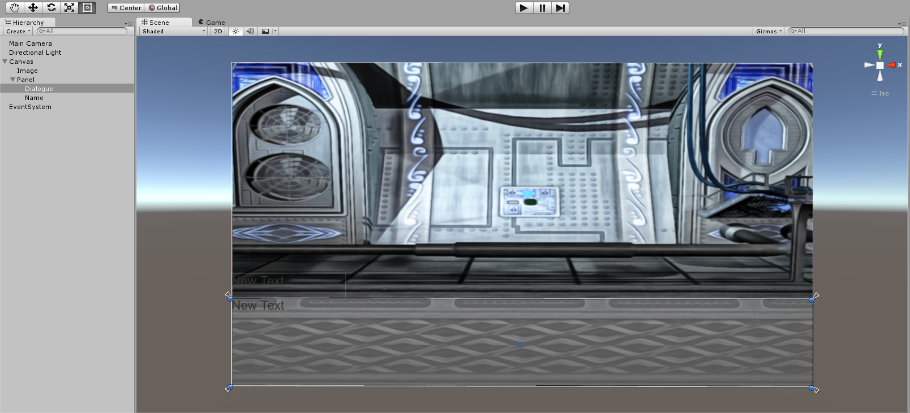

This tutorial will help you create a basic visual novel framework that you can use your own story and art in, as well as expand upon the framework itself with more functionality. I will say I’m not the best Unity dev and there are probably better ways to lay out this framework but this will give you a good start if you want to quickly get started with game development. You can see and download the games [source code on Github](https://github.com/cxsquared/Visual-Novel-Tutorial).

A lot of this tutorial was adapted and inspired from TheHappieCat’s tutorial on the same subject. You can check out her [channel on Youtube](https://www.youtube.com/user/TheHappieCat) for more awesome game development videos. If you’d like a more in-deepth look at the basics I recomend checkout out [Unity’s documentation](http://docs.unity3d.com/Manual/UnityBasics.html).

## Planning

* Intro

One of most important step to starting any game project is getting a decent plan in place. Just having a simple road map with the features you want can help guide you and make your time writing code and creating content more efficient. This tutorial will guide you through the steps to create a visual novel framework that you can use to create a game using your own story and art.

* Road Map

The visual novel we are going to create is a basic one with only a few features. The basic features of a visual novel are:

* Scenes

You can think of these as the chapters to our visual novel. The scenes will hold the dialogue information for each encounter that you decide to create.

* Characters

You can’t have a “visual” novel without having characters. The characters will contain the information about their art and different possible poses.

* Dialog

What good is a character if it can’t say anything? The dialog will be our script that the players will end up reading.

* Choices

Choices are what separates a game from other forms of media and lest the player interact with the game. The choices will go hand in hand with the dialog to allow the player to experience a dynamic story.

All these parts come together to make a system that will allow you to create your own visual novel experience.

## Making the Game

So now we’ll open Unity, I’m using version 5.1.1, and create a new project. Even though this is going to be a 2D type project I’m going to just use the default Unity 3D project.


## Scene View


When your project is created you should be greeted with a default scene with just a Main Camera and Direction Light. The big grid image you see in the middle of the screen is your Scene view. This is where you’ll normally arrange things in the game, such as characters and objects. Using the mouse you can move around in the scene view. For now I’m going to assume you know the basics of scene view movement. You really won’t need much of it but if you’d like to look into it more you can check out [Unity’s manual page](http://docs.unity3d.com/Manual/SceneViewNavigation.html).  Since we are really only concerned about 2D movement we are going to change the scene view to fit our needs a little better.


In the top right there is a little square with colored cones coming out of it, this is called the scene gizmo and it helps control how you view the current scene. You’ll want to click on the red X cone, then the white cone to the left of that, and finally click the center square. This should make the scene view compress the z or front and back axis. Basically we just have a 2D area to work with now.

## Hierarchy


If you look to the left there should be a tab called Hierarchy that contains a Main Camera and a Directional Light. Everything in the hierarchy is what will be a part of the game. The hierarchy is made up of Unity GameObjects. GameObjects are the basic components of every Unity game. All GameObjects contain Components that tell the GameObject what to do or how to function inside the game. Components are modules such as scripts or renderers that give instructions to the GameObject.
If you click on the Main Camera object you should see the right side of the screen, under the tab that says Inspector, a bunch of different Components that allow the Main Camera to function as a camera. The top Component is called a Transform. All GameObjects have a transform and this is what tells the GameObject where to place itself inside our game world and scene view. We’ll talk more about the different Components and how they interact as we start to add stuff to our game.

## Scenes

By this point you should have a small understanding of what you are seeing on screen. We’ll cover more of the interface as the tutorial goes on. The next concept you need to understand is Scenes. Now this Scene concept is different from what I planned out above. A Scene is how Unity differentiates levels. We’ll leverage that fact to create our scenes/chapters in the game. Each one of the scenes/chapters we create in the game will be saved as a Unity Scene.
Let’s go ahead and save our first Scene. So go click File > Save Scene which should open up a file dialog in your Assets folder of your Unity project. I believe keeping things organized in a game project is very important so go ahead and create a folder named “Scenes” and then save your scene inside that folder with a name of “Scene1”. This naming convention is very important because we are going to use it to switch between scenes later.


After you are done you should be able to look down at the bottom of the screen for a tab called Project. This is your Project Browser and it shows all the files that are a part of your game. It should look similar to this picture with just a folder that says Scenes and inside that folder is your saved Scene called Scene1.


## UI

We are going to be using Unity’s UI system to show are background, text, and decision buttons. Now we are going to add our first GameObject to our scene. Right click in the Hierarchy, a menu should pop up, go down to UI, and finally click Image. Three more things should pop up in your Hierarchy, a Canvas, an Image, and an EventSystem. The Canvas is a great tool that Unity has given us to help with scaling different to different resolutions for things like phones and other screens that have different resolutions. The Canvas is going to hold our UI objects, and along with the EventSystem object, control our UI objects. You don’t really need to know much about the EventSystem object just as long as it’s there.


You should notice that a little arrow has been created next to the Canvas in the Hierarchy. If you click on it the Image GameObject will disappear. This is because the Image is a child of the Canvas. The Child/Parent relationship of GameObjects is important to understand in Unity. Because the Image is a Child of the Canvas, whenever you move the Canvas the Image will move along with it. The Image’s transform location is now based on the Parent object. This can be a very powerful tool to when making games with Unity.

## Image

Now that we have our Image object go ahead and click on it. We are going to add our first visual. This is kind of an option step as you don’t necessarily need a background but it will help set the mood for your scene. I’m using art that I received as part of a Humble Bundle but you can easily grab some art off of [OpenGameArt.org](http://opengameart.org/) or make your own! To add the background image to Unity you just need to drag the file from your file browser to the Unity Project Browser. The image should just pop up in the Project Browser.

Now sticking with our organization we need to create a new folder in Assets called “Sprites” then drag our new image into that folder. Feel free to rename the image whatever you want to keep yourself organized. Once you click on the image you should see some information pop up in the Inspector tab. To get this image to just function as a sprite we need to click on the drop down menu next to Texture Type. From that drop down menu select Sprite (2D and UI) then click the Apply button a little lower down and you are good to go.


To set the sprite we just imported as what shows up in the image GameObject we need to click on the Image GameObject in the Hierarchy. You should see the Components pop up under the Inspector tab. We are going to do a few things with these Components but first let’s get our background showing. The last Component on the Image GameObject is called Image (Script), this is where we will set our image to show up. There is a box labeled Source Image and next to it it should say None (Sprite). What we are going to do is drag our background sprite from our Project browser to the None (Sprite) box. Your Image (Script) Component should now have your background sprite next to the label Source Image.


## Toolbar

Now we are going to do is see the whole Canvas so that we can resize the image. To do this select the Canvas GameObject under the Hierarchy, then move your mouse over the Scene View and hit “f” on your keyboard. The “f” key focuses on the currently selected GameObject. This should put the Canvas in the middle of your Scene View and you should be able to see the image you added.


The first thing we need to do is resize the image to fit the whole Canvas. To do that click on the image either in the Hierarchy or in the Scene View. You should see a green and red arrow sticking out of the center of the image. This is the translate tool and allows you to move the image around in the Scene View. So using the green and red arrow grab them and move the image to the top left of the Canvas which is the white outline you should see on the screen.


Now right under the File and Edit buttons at the top you should see a row of icons one of which looks like a hand and at the other end should be a square with a dot in the middle. This is your Toolbar which houses the tools to manipulate GameObjects in the Scene View. Go ahead and select the last icon which looks like a square with a circle in the middle. You should now get little blue dots on the corners of your image. This should be familiar with those who use photo editing/creation software. Click and drag the bottom right blue circle to the bottom right corner of the Canvas. This should stretch your image across the whole canvas.

## Anchors

A big part of the Unity UI system is what is called anchors. The anchors tell the Canvas how it  should resize GameObjects inside it when the screen is resized. There should be a little “X” looking shape in the middle of the canvas right now. This is actually the anchor points. What it’s saying right now is that the image should just always be in the center without resizing. We need to change that to say we want the image to resize with the Canvas size because the Canvas will adapt to whatever screen size we use. Click on one the corners of the “X” and drag it to the corresponding corner of the Canvas. When you move one corner you should some of the other corners of the “X” move and a grid pop up. Drag whatever corner is left to it’s corner of the Canvas. You should see 100% on both the left side and bottom. Now that we have all the anchors set to the corners of the Canvas whenever the canvas resizes the image will as well.


## More UI

The next thing we are to add is a panel so right click on your Hierarchy, go to UI, and click panel. This is going to hold are text and choice buttons. You can just think of this as a box to help us control where things are going to show up. Go ahead resize it so it fills up the bottom section like a typical dialogue box. Then make sure the anchors only go to the corners of the panel so that the panel resizes and keeps the same proportions to the background image.


The next thing we are going to create is a text box to show what the characters are going to say. It will almost be the same as creating the Image and Panel but this time right click on the Panel in the Hierarchy and go to UI and then select Text. This creates a text box that we’ll use to show the dialogue. Resize the Text GameObject to fit the panel and set the anchors to the corners of the Panel. One important thing we are going to do is rename the GameObject to “Dialogue”. You can do this by either right clicking on the GameObject inside Hierarchy and clicking rename or changing the name at the top of the Inspector when the GameObject is selected.
Now go ahead and do the same thing again for a textbox that will show the name of the character. The only difference is that I placed it above the panel along the left side and made it only slightly bigger than when it was created. The anchors should be the same as the dialogue box. You should name this textbox “Name”. You can set the font and font size inside the Inspector whatever you think looks good for both textboxes. For the Dialogue box I also clicked the center icon in both alignment categories to center the text.



## Dialogue Parser

Now we are going to start actually making our game do things. Now this isn’t really a guide to teach you how to code but I will be going through each script and what each function is doing. The first thing we are going to do is write a Dialogue Parser. What this is going to do is take a text file we create which will hold the actual text of what is happening and then present that text to the player. We are going to be using a simple system to allow you to just write and not touch code to add more to the game. The Dialogue file will contain information on the character, what the character should look like, what each character should say, and what choices to give the player.
Let’s create a basic dialogue script file to show you what the Dialogue Parser will actually do. This step will actually take us out of Unity for a second. Open up your favorite text editor, I’ll be using Sublime Text but Notepad works just fine. Then we’ll write the dialogue in this style.

```markup
Kyle;Hey what's up;0;R
Orien;Nothing much man;0;L
Kyle;Oh that's cool;1;R
Player;Restart:line,0;Continue:line,4
Kyle;This is a test;2;L
Orien;Test test test test;2;R
```

So what is happening is that each line will be one line of dialogue that will be shown to the player. When the player clicks their mouse the next line will show. The first part is the character name which will help pick what art to show. The next part after the first “;” is the actual line that will be shown in the dialogue box. After that is what pose you want the character to have. This will be set individually for each character. Each character will have different artwork based on which number is put. The last part is which side of the screen to show the art on to show some motion in the game. Save this file in your Unity Project's Assets folder under a new folder called Data and call the file “Dialogue1.txt”.


Let’s get to writing the actual code. To create the script head back into Unity. Create a new folder in the Assets folder called “Scripts”. Inside this folder right click, go to the top of the menu, and then click C# Script. Name that new file “DialogueParser”. Now if you double click you that it should bring up Monodevelop which is what you will be programming in.

When the file opens you should see two function Start() and Update(). Both of these functions are called automatically by Unity. Start() is called when the GameObject the script is attached to is first created then Update() is called every Unity update frame. If you want to learn more about the basics of Unity scripting you can check out [there documentation](http://docs.unity3d.com/ScriptReference/).

The first thing you are going to need to do is add a few more using statements to the top of the code. Using just tells Unity that we need to use Scripting Classes that Unity has already made for us to use. We are going to be adding UnityEditor, System.Text, System.IO, System.Text.RegularExpressions, and System.Collections.Generic.

```csharp
using UnityEngine;
using System.Collections;
using UnityEditor;
using System.Text;
using System.IO;
using System.Text.RegularExpressions;
using System.Collections.Generic;

public class DialogueParser : MonoBehaviour {
```

The next line of code is creating a Struct. A Struct is a powerful tool to help us represent something in the code. In this case we are representing a DialogueLine. Each one of our lines has a few components to it. Each line has a name, content, pose, position, and a fifth variable which is going to be the options the player will have when given choices. An important thing to have in the Struct is a constructor. This is the first thing that will be ran when we create each line and it is setting the data of the line for us.

```csharp
public class DialogueParser : MonoBehaviour {

    struct DialogueLine {
        public string name;
        public string content;
        public int pose;
        public string position;
        public string[] options;

        public DialogueLine(string Name, string Content, int Pose, string Position) {
            name = Name;
            content = Content;
            pose = Pose;
            position = Position;
            options = new string[0];
        }
    }
```

The next thing we need to do is set up a variable to contain all the different lines of dialogue we will have. We are using a List to hold the DialgueLines. You can think of a List as a office cabinet where you can store things with specific labels and in specific orders. The order thing will be very important for us because we want the lines to be shown to the player in a specific order

```csharp
public class DialogueParser : MonoBehaviour {

    struct DialogueLine {
        ...
    }

    List<DialogueLine> lines;
```

Now to work with our Start() function. What this function is doing for us is dynamically getting the dialogue file that we saved by looking at the name of the Unity Scene we are in and getting the number from that. It also instantiates the lines List which tells the computer to give use memory to store things in the List because we are about to put things in the List.  And finally we pass our dialogue file location to a new function called LoadDialogue() that we are about to create.

```csharp
List<DialogueLine> lines;

    // Use this for initialization
    void Start () {
        string file = "Assets/Data/Dialogue";
        string sceneNum = EditorApplication.currentScene;
        sceneNum = Regex.Replace (sceneNum, "[^0-9]", "");
        file += sceneNum;
        file += ".txt";

        lines = new List<DialogueLine>();

        LoadDialogue (file);
    }

    // Update is called once per frame
    void Update () {

    }
```

Let’s create the LoadDialogue() function. Each function starts with what it will return when called. In this case it’s void because we aren’t returning anything then we have the name of the function, and finally inside the parentheses we have what the function expects to get when called which in our case is a string of the filename. For the function we are using the line variable to store each line we read from the file. To actually read the file we use a StreamReader which job is to do all the low level work for us. Next we have a do-while loop. All this is saying is do this chunk of code, while our line does not equal null aka actually exists. Once there aren’t any more lines this do-while loop will stop. Inside the while we set the line to the current line the StreamReader has. If that is actually a line we then use that data to create a new DialogueLine and store it in our lines. I’m just splitting the line at “;” which is what we used to separate our dialogue parts. Another thing is that if you put Player as the name it’s expecting to give the player options and doesn’t want content, position, or pose. After all that is done we close the StreamReader.

```csharp
// Update is called once per frame
    void Update () {

    }

    void LoadDialogue(string filename) {
        string line;
        StreamReader r = new StreamReader (filename);

        using (r) {
            do {
                line = r.ReadLine();
                if (line != null) {
                    string[] lineData = line.Split(';');
                    if (lineData[0] == "Player") {
                        DialogueLine lineEntry = new DialogueLine(lineData[0], "", 0, "");
                        lineEntry.options = new string[lineData.Length-1];
                        for (int i = 1; i < lineData.Length; i++) {
                            lineEntry.options[i-1] = lineData[i];
                        }
                        lines.Add(lineEntry);
                    } else {
                        DialogueLine lineEntry = new DialogueLine(lineData[0], lineData[1], int.Parse(lineData[2]), lineData[3]);
                        lines.Add(lineEntry);
                    }
                }
            }
            while (line != null);
            r.Close();
        }
    }
```

That’s the bulk of our dialogue parser done. All we need now is a way to get the line information from the parser to use in different areas like actually setting it as the text box. So what we are going to create are getters for all our DialogueLine variables. The getters has to be public and is going to return something. It’s expecting to get a lineNumber that it will use to get the DialogueLine and find the data to return. Here are all of the getters.

```csharp
    void LoadDialogue(string filename) {
    ...
    }

    public string GetPosition(int lineNumber) {
        if (lineNumber < lines.Count) {
            return lines[lineNumber].position;
        }
        return "";
    }

    public string GetName(int lineNumber) {
        if (lineNumber < lines.Count) {
            return lines[lineNumber].name;
        }
        return "";
    }

    public string GetContent(int lineNumber) {
        if (lineNumber < lines.Count) {
            return lines[lineNumber].content;
        }
        return "";
    }

    public int GetPose(int lineNumber) {
        if (lineNumber < lines.Count) {
            return lines[lineNumber].pose;
        }
        return 0;
    }

    public string[] GetOptions(int lineNumber) {
        if (lineNumber < lines.Count) {
            return lines[lineNumber].options;
        }
        return new string[0];
    }
}
```

That’s all of the code for our dialogue parser

```csharp
using UnityEngine;
using System.Collections;
using UnityEditor;
using System.Text;
using System.IO;
using System.Text.RegularExpressions;
using System.Collections.Generic;

public class DialogueParser : MonoBehaviour {

    struct DialogueLine {
        public string name;
        public string content;
        public int pose;
        public string position;
        public string[] options;

        public DialogueLine(string Name, string Content, int Pose, string Position) {
            name = Name;
            content = Content;
            pose = Pose;
            position = Position;
            options = new string[0];
        }
    }

    List<DialogueLine> lines;

    // Use this for initialization
    void Start () {
        string file = "Assets/Data/Dialogue";
        string sceneNum = EditorApplication.currentScene;
        sceneNum = Regex.Replace (sceneNum, "[^0-9]", "");
        file += sceneNum;
        file += ".txt";

        lines = new List<DialogueLine>();

        LoadDialogue (file);
    }

    // Update is called once per frame
    void Update () {

    }

    void LoadDialogue(string filename) {
        string line;
        StreamReader r = new StreamReader (filename);

        using (r) {
            do {
                line = r.ReadLine();
                if (line != null) {
                    string[] lineData = line.Split(';');
                    if (lineData[0] == "Player") {
                        DialogueLine lineEntry = new DialogueLine(lineData[0], "", 0, "");
                        lineEntry.options = new string[lineData.Length-1];
                        for (int i = 1; i < lineData.Length; i++) {
                            lineEntry.options[i-1] = lineData[i];
                        }
                        lines.Add(lineEntry);
                    } else {
                        DialogueLine lineEntry = new DialogueLine(lineData[0], lineData[1], int.Parse(lineData[2]), lineData[3]);
                        lines.Add(lineEntry);
                    }
                }
            }
            while (line != null);
            r.Close();
        }
    }

    public string GetPosition(int lineNumber) {
        if (lineNumber < lines.Count) {
            return lines[lineNumber].position;
        }
        return "";
    }

    public string GetName(int lineNumber) {
        if (lineNumber < lines.Count) {
            return lines[lineNumber].name;
        }
        return "";
    }

    public string GetContent(int lineNumber) {
        if (lineNumber < lines.Count) {
            return lines[lineNumber].content;
        }
        return "";
    }

    public int GetPose(int lineNumber) {
        if (lineNumber < lines.Count) {
            return lines[lineNumber].pose;
        }
        return 0;
    }

    public string[] GetOptions(int lineNumber) {
        if (lineNumber < lines.Count) {
            return lines[lineNumber].options;
        }
        return new string[0];
    }
}
```

Now we need to add it to our game so that it will actually run. To do this go back into Unity, right click in the Hierarchy and click Create Empty. This gives us an empty GameObject to work with.


So go ahead and click on the GameObject and rename it to Dialogue Parser. To acutally get our parser working we need to add the Script to the GameObject. There’s two ways to do this: either drag-and-drop the Script from the Project Browser to the GameObject’s inspector, or in the GameObject’s inspector click Add Component and search for the DialogueParser script. In the end the script should show up in the GameObjects Inspector. Now when we click play are DialogueParser is parsing all the data we have saved in our Dialogue1.txt file. You won’t see it now but soon we will start to hook everything up.


## Dialogue Manager

Time for a new Script! This Script will be called “DialogueManager” and it will be the bridge between our DialogueParser and the text boxes that will actually show the game dialogue. So let’s get to it and right click in our Scripts folder and create a new C# Script called “DialogueManager”. Double click on it to open it up in Monodevelop. The first thing we need to do is add a few using at the top: UnityEngine.UI, and System.Collecitons.Generic;

```csharp
using UnityEngine;
using System.Collections;
using UnityEngine.UI;
using System.Collections.Generic;

public class DialogueManager : MonoBehaviour {
```

We need a lot more variable this time compared to the DialogueParser. The first thing we need is a DialogureParser so that we can get the information for it to show in the text boxes. Then we need a variable for each thing that we are expecting from the DialogueParser so we need a string for the dialogue, a string for the character name, an int for the line number, an int for the pose, a string for the character position, and a string array (which is created with the [] symbols) for the player decision options to be stored. On top of that we need a boolean (which is just a variable that holds true or false) to see if the player is making a decision and a List to keep track of the buttons we create for the player decisions. Then we need 3 public variables that are going to be the dialogue text box we created earlier, the name text box we created earlier, and a GameObject to hold our choice button prefab. We’ll get to learning about Prefabs a little later in the tutorial.

```csharp
public class DialogueManager : MonoBehaviour {

    DialogueParser parser;

    public string dialogue, characterName;
    public int lineNum;
    int pose;
    string position;
    string[] options;
    public bool playerTalking;
    List<Button> buttons = new List<Button> ();

    public Text dialogueBox;
    public Text nameBox;
    public GameObject choiceBox;
```

Now let’s get going with the Start() function. Here we are just initializing all our variables so that if we look at them before anything has happened it won’t break the game. For our parser we need to find the DialogueParser GameObject in the Scene. Luckily Unity has a great function for that called Find. This finds any GameObject within in our Scene and since we only have one DialogueParser GameObject we don’t have to worry about Unity finding the wrong one. After the GameObject is found we then have to get the actual DialogueParser script from the GameObject. To do this we just use GetComponent(). Now that we have the DialogueParser script we can get information about each line to show in our text boxes.

```csharp
public class DialogueManager : MonoBehaviour {

    ...

    // Use this for initialization
    void Start () {
        dialogue = "";
        characterName = "";
        pose = 0;
        position = "L";
        playerTalking = false;
        parser = GameObject.Find("DialogueParser").GetComponent<DialogueParser>();
        lineNum = 0;
    }
```

Unlike the DialogParser class we are going to use the Update() method. The Update() method is called every frame update inside of Unity so the Update() function is constantly called. This function is really useful for constantly keeping track of things like player input in the game. We are going to use to it make detect if the player presses the left mouse button and to keep the UI up-to-date. So everytime the player presses the mouse button and there isn’t player choice options up we show the dialogue and go to the next line number.

```csharp
void Start () {
    ...
}

// Update is called once per frame
void Update () {
    if (Input.GetMouseButtonDown (0) && playerTalking == false) {
        ShowDialogue();

        lineNum++;
    }

    UpdateUI ();
}
```

The ShowDialogue() function just calls to other functions that are used to show the Dialogue.

```csharp
void Update () {
    ...
}

public void ShowDialogue() {
    ResetImages ();
    ParseLine ();
}
```

The ResetImages() function is used to remove any old images for each dialogue line. We wouldn’t want the wrong character staying on screen while someone else was talking. To do this we search for a GameObject with the same name as the character. We don’t have any characters in our Scene right now but we’ll get to that. Then we find the SpriteRenderer Component on the character GameObject. The SpriteRenderer controls what is show on screen just like the Image component did earlier in the tutorial. Then we set the sprite to null. By doing this we are just saying to not show any sprite right now.

```csharp
void ResetImages() {
    if (characterName != "") {
        GameObject character = GameObject.Find (characterName);
        SpriteRenderer currSprite = character.GetComponent<SpriteRenderer>();
        currSprite.sprite = null;
    }
}
```

The next thing the ShowDialogue() function does after resetting the images is to parse the current line by calling ParseLine(). First the thing we do is use the parser to get the character name of the line we are on by using the function GetName() that we made back when creating the DialogueParser. We use an If statement to check if the name is “Player”. If it is we know that we want to show player options and if it isn’t we just want to show a normal dialogue line. To show a normal dialogue line we first set playerTalking to false because the player isn’t talking. Then we set all the variables to the matching ones inside the parser. And finally we call DisplayImages() which is going to show the character image on screen. If we need to show player choices we first set playerTalking to true and then set all the variables to a nothing value so that nothing else is show besides the player choices. We get the options from the parser then call CreateButtons() which will use the options to create the buttons the player can click on.

```csharp
void ParseLine() {
    if (parser.GetName (lineNum) != "Player") {
        playerTalking = false;
        characterName = parser.GetName (lineNum);
        dialogue = parser.GetContent (lineNum);
        pose = parser.GetPose (lineNum);
        position = parser.GetPosition (lineNum);
        DisplayImages();
    } else {
        playerTalking = true;
        characterName = "";
        dialogue = "";
        pose = 0;
        position = "";
        options = parser.GetOptions(lineNum);
        CreateButtons();
    }
}
```

The next thing we’ll work on is the DisplayImages() function which is in charge of showing the current characters image on screen. We first make sure that a character is talking by checking if characterName isn’t equal to an empty string. If the character is actually a character we go ahead and find their GameObject in the Scene. We then call a function that set’s their location on in the Scene. Finally we get their SpriteRenderer Component and set that to the pose based on their Character Class that we’ll make later on.

```csharp
void DisplayImages() {
    if (characterName != "") {
    GameObject character = GameObject.Find(characterName);

        SetSpritePositions(character);

        SpriteRenderer currSprite = character.GetComponent<SpriteRenderer>();
        currSprite.sprite = character.GetComponent<Character>().characterPoses[pose];
    }
}
```

For the SetSpritePositions() function it need to take in a GameObject to move it. Every GameObject has a transform that is used to set the position of the GameObject in the Scene. To set it we just check if the position which we got from the parser is a “L” or a “R”. Then we use the GameObjects transform.position to set it to a new Vector3. A Vector is just a collection of numbers the 3 just says there’s are 3 numbers in the Vector. We are setting the x and y position of the Character. At the end we make sure the Z of the position is set to 0 so that it renders at the correct size. Changing that number would push it closer or farther from the camera.

```csharp
void SetSpritePositions(GameObject spriteObj) {
    if (position == "L") {
        spriteObj.transform.position = new Vector3 (-6, 0);
    } else if (position == "R") {
        spriteObj.transform.position = new Vector3 (6, 0);
    }
    spriteObj.transform.position = new Vector3 (spriteObj.transform.position.x, spriteObj.transform.position.y, 0);
}
```

Now let’s look at the second function that can be called from ParseLine() which is CreateButtons(). This function will create the buttons that the player can click to make a decision. To do this we use a for loop which just says run this code as long as i is less than options.Length which is how many options the player will have. We then use Unity’s Instantiate() function to create a new GameObject. This is similar to dragging a GameObject into the Scene or Hierarchy. Then we have to get the Button component and ChioceButton Script off of the button GameObject. We use the ChoiceButton Script to set the Text of the buttno and to set the option of the button so the button knows what to do when it is clicked. And we tell the button the DialogueManager created it by setting cb.box to “this”. The word “this” just means a reference to the current Script DialogueManger in this case. We then make the button a child of whatever GameObject the DialogueManager is connected to. In this case that means the Panel that is part of the Canvas. Then we set the location and scale based on the Panel GameObject. And finally we add the button to the buttons list to keep track of it.

```csharp
void CreateButtons() {
    for (int i = 0; i < options.Length; i++) {
        GameObject button = (GameObject)Instantiate(choiceBox);
        Button b = button.GetComponent<Button>();
        ChoiceButton cb = button.GetComponent<ChoiceButton>();
        cb.SetText(options[i].Split(':')[0]);
        cb.option = options[i].Split(':')[1];
        cb.box = this;
        b.transform.SetParent(this.transform);
        b.transform.localPosition = new Vector3(0,-25 + (i*50));
        b.transform.localScale = new Vector3(1, 1, 1);
        buttons.Add (b);
    }
}
```

After we parse the dialogue we have to update the UI using the UpdateUI() function. If the player isn’t talking we call ClearButtons() which just destroys all buttons in the buttons List. Then we just set the dialogue text and name text to the appropriate string.

```csharp
void UpdateUI() {
    if (!playerTalking) {
        ClearButtons();
    }
    dialogueBox.text = dialogue;
    nameBox.text = characterName;
}
```

Finally we just have to write the ClearButtons() function. This just uses a for loop to loop through all the buttons inside the buttons List. It then sets the button to a variable because we then remove it from the buttons List and then call Destroy() on it which just does what it says and destroys the GameObject.

```csharp
void ClearButtons() {
    for (int i = 0; i < buttons.Count; i++) {
        print ("Clearing buttons");
        Button b = buttons[i];
        buttons.Remove(b);
        Destroy(b.gameObject);
    }
}
```

That’s it for the DialogueManager. If you head back into Unity you’ll probably be getting some errors but that’s fine. Before we can actually add our DialogueManager Script to the game we have to create two more small scripts and learn about Prefabs!

```csharp
using UnityEngine;
using System.Collections;
using UnityEngine.UI;
using System.Collections.Generic;

public class DialogueManager : MonoBehaviour {

    DialogueParser parser;

    public string dialogue, characterName;
    public int lineNum;
    int pose;
    string position;
    string[] options;
    public bool playerTalking;
    List<Button> buttons = new List<Button> ();

    public Text dialogueBox;
    public Text nameBox;
    public GameObject choiceBox;

    // Use this for initialization
    void Start () {
        dialogue = "";
        characterName = "";
        pose = 0;
        position = "L";
        playerTalking = false;
        parser = GameObject.Find("DialogueParser").GetComponent<DialogueParser>();
        lineNum = 0;
    }

    // Update is called once per frame
    void Update () {
        if (Input.GetMouseButtonDown (0) && playerTalking == false) {
            ShowDialogue();

            lineNum++;
        }

        UpdateUI ();
    }

    public void ShowDialogue() {
        ResetImages ();
        ParseLine ();
    }

    void UpdateUI() {
        if (!playerTalking) {
            ClearButtons();
        }
        dialogueBox.text = dialogue;
        nameBox.text = characterName;
    }

    void ClearButtons() {
        for (int i = 0; i < buttons.Count; i++) {
            print ("Clearing buttons");
            Button b = buttons[i];
            buttons.Remove(b);
            Destroy(b.gameObject);
        }
    }

    void ParseLine() {
        if (parser.GetName (lineNum) != "Player") {
            playerTalking = false;
            characterName = parser.GetName (lineNum);
            dialogue = parser.GetContent (lineNum);
            pose = parser.GetPose (lineNum);
            position = parser.GetPosition (lineNum);
            DisplayImages();
        } else {
            playerTalking = true;
            characterName = "";
            dialogue = "";
            pose = 0;
            position = "";
            options = parser.GetOptions(lineNum);
            CreateButtons();
        }
    }

    void CreateButtons() {
        for (int i = 0; i < options.Length; i++) {
            GameObject button = (GameObject)Instantiate(choiceBox);
            Button b = button.GetComponent<Button>();
            ChoiceButton cb = button.GetComponent<ChoiceButton>();
            cb.SetText(options[i].Split(':')[0]);
            cb.option = options[i].Split(':')[1];
            cb.box = this;
            b.transform.SetParent(this.transform);
            b.transform.localPosition = new Vector3(0,-25 + (i*50));
            b.transform.localScale = new Vector3(1, 1, 1);
            buttons.Add (b);
        }
    }

    void ResetImages() {
        if (characterName != "") {
            GameObject character = GameObject.Find (characterName);
            SpriteRenderer currSprite = character.GetComponent<SpriteRenderer>();
            currSprite.sprite = null;
        }
    }

    void DisplayImages() {
        if (characterName != "") {
            GameObject character = GameObject.Find(characterName);

            SetSpritePositions(character);

            SpriteRenderer currSprite = character.GetComponent<SpriteRenderer>();
            currSprite.sprite = character.GetComponent<Character>().characterPoses[pose];
        }
    }


    void SetSpritePositions(GameObject spriteObj) {
        if (position == "L") {
            spriteObj.transform.position = new Vector3 (-6, 0);
        } else if (position == "R") {
            spriteObj.transform.position = new Vector3 (6, 0);
        }
        spriteObj.transform.position = new Vector3 (spriteObj.transform.position.x, spriteObj.transform.position.y, 0);
    }
}

```

## Prefab Button

Prefabs in Unity are premade GameObjects that we can use to create new GameObjects on the fly. This is a super powerful tool inside of Unity. First we are going to create the ChoiceButton prefab which will be the button that shows up to give players options of things to do.

To create our button prefab we first need to create a button attached to the Panel inside the canvas. To do that right click on the Panel GameObject in the Hierarchy, select UI, and then click on Button. A button should pop up in the middle of your Panel. Now grab your buttons anchor points and set them to the same size as the Panel. This is to make sure that when the panel resizes that the button will resize with it.


The next thing we need to do is create a script that will be able to handle when the button is clicked. So right click in your Project Browser in your Scripts folder and create a new C# Script. Name this Script “ChoiceButton” and then open it by double clicking on it. This Script is going to be a lot smaller than the last two scripts. We first need two variables, one string to hold the option for the button and a variable to hold the DialogueManager.

```csharp
using UnityEngine;
using System.Collections;
using UnityEngine.UI;

public class ChoiceButton : MonoBehaviour {

    public string option;
    public DialogueManager box;
```

We don’t need to touch the Start() or Update() function so the next thing we are going to do is create a function called SetText() which takes in a string as it’s argument. All this function is doing is finding the text in the button and setting it to something new.

```csharp
public void SetText(string newText) {
    this.GetComponentInChildren<Text> ().text = newText;
}
```

The next function, SetOpiton() does almost the same thing as the last function except it sets the option instead of the text. The option is going to be what we will look at to determine what to do when the button is clicked

```csharp
public void SetOption(string newOption) {
    this.option = newOption;
}
```

The final function is ParseOpiton() which is what is going to happen when the Player clicks the button. We first split the option at the ‘,’ to separate the command from the number. After we have the command and the number we tell the DialogueManager that the player isn’t talking anymore because they’ve clicked the button. We then use an if statement to check if the option is going to change the line the player is on or change the scene. If they are changing the line then we just change the line inside of the DialogueManager. If it’s changing the scene we use a Unity class called Application to load the scene we want.

```csharp
public void ParseOption() {
    string command = option.Split (',') [0];
    string commandModifier = option.Split (',') [1];
    box.playerTalking = false;
    if (command == "line") {
        box.lineNum = int.Parse(commandModifier);
        box.ShowDialogue ();
    } else if (command == "scene") {
        Application.LoadLevel("Scene" + commandModifier);
    }
}
```

Here's the complete ChoiceButton Script.

```csharp
using UnityEngine;
using System.Collections;
using UnityEngine.UI;

public class ChoiceButton : MonoBehaviour {

    public string option;
    public DialogueManager box;

    // Use this for initialization
    void Start () {

    }

    // Update is called once per frame
    void Update () {

    }

    public void SetText(string newText) {
        this.GetComponentInChildren<Text> ().text = newText;
    }

    public void SetOption(string newOption) {
        this.option = newOption;
    }

    public void ParseOption() {
        string command = option.Split (',') [0];
        string commandModifier = option.Split (',') [1];
        box.playerTalking = false;
        if (command == "line") {
            box.lineNum = int.Parse(commandModifier);
            box.ShowDialogue ();
        } else if (command == "scene") {
            Application.LoadLevel("Scene" + commandModifier);
        }
    }
}

```

Now that this is done we want to attach the ChoiceButton Script to the button object we’ve already created on the Panel. But before we do that we have to clear all the errors. To do this just create a new Script in the Project Browser called Character. Open up the Character Script you just created and add one variable called characterPoses that will be a Sprite array.

```csharp
using UnityEngine;
using System.Collections;

public class Character : MonoBehaviour {

    public Sprite[] characterPoses = null;

    // Use this for initialization
    void Start () {

    }

    // Update is called once per frame
    void Update () {

    }
}
```

Once this is done go back to Unity and you shouldn’t have any errors. So now add the ChoiceButton Script to our button GameObject. Do this by either dragging the script to the GameObject in the Hierarchy or clicking Add Component in the buttons Inspector.


You should see the script pop up inside the Buttons Inspector with the variables you made public. The great thing about Unity is that you can now change those variables from inside the Editor and don’t have to touch the code again. Now comes the fun part where we are going to actually create our Prefab. To do this first make a new folder in your Project Browser called Prefabs. I’m just doing this for organization purposes. So now we just click and drag our button GameObject from the Hierarchy to the Prefabs folder we just created. And you're done creating a prefab.


So click on the new Prefab in your Project Browser because we have to set up one thing before we are done with the button. We need to tell the button what to do when it’s clicked. To do this click on the button Prefab and look at the Inspector. You should see a box called OnClick() inside of the Button component. Click the little + icon in the bottom right corner of the box. This will bring up a box inside the box. Click on the new box and click your button prefab. Now we can click on the dropdown menu next to the box and find ChoiceButton then set it to ParseOptions. This tells the button to call ParseOptions when it’s clicked. The button is now done. We need to clean things up by deleting the button from the Hierarchy.


## Character

The final component we need to create is the Character Prefab. Each different Character is going to have it’s own prefab. So go ahead and create a new Empty GameObject in our Hierarchy. And name it the exact same name as you are using in your dialog text file we created earlier. We need a way to show the character sprites so click on Add Component inside your Character GameObject you just created and select Sprite Renderer. The new component we need to add is the Character Script we created a little earlier so go ahead and do that now.

We need to add at least one picture for each character so I’m going to drag a few images inside our sprite folder. Once they are imported you need to make sure to set all image Texture Types to Sprite. To do this use click on the image in the Project Browser and then look at the Inspector and you should see the Texture Type box.


Now that we have our character pictures in our game we need to add them to the character GameObject. Click your character GameObject and in the inspector you should see the Character Script we added. On that Script component you should see the variable Character Poses that we added to the Script earlier. Now you can just drag your character sprites on to the Character Poses. This will be the poses for your character and so the first one you add will be pose 0 in your dialogue text. If you click the grey arrow next to the Character Poses you should see all the images you’ve added.


Now your character is done, I’m going to make my characters presets so that I can quickly add them to each scene I create. It’s important to have your character in your scene if you want them to show up. I’m also going to go ahead and make my second character just like I made my first just with a different name.


Now we are almost done. One of the last things we need to do is hook everything up. Click on your Panel and click Add Component. We are going to add the DialogueManager class to our Panel. Once you’ve added it you need to drag both the Dialogue text box and the Name text box to the appropriate variable spot inside the DialogueManager. And for the Choice Box you need to drag our button prefab into it.


Now if you run it we still have a few problems but most of it should be working. First we need to set our Canvas to be an actual layer inside our Camera. Right now it just an overlay to and doesn’t have depth. To do this click on your Canvas in the Hierarchy and under Render Mode select Screen Space - Camera. Click on Render Camera and select Main Camera and then set the Order in Layer to -1 so it shows up behind the characters. If you play it now you’ll see characters pop up but the player buttons still won’t be working.

The last thing we need to do is go into the button Prefab. Now set the Left and Right to both -250, the Top to -50, and the Bottom to 0. This will make the buttons show up the right way.


Now you have a visual novel that you can build off of. This isn’t necessarily the best way to do this but it is a flexible way. Feel free to add more game mechanics, create new character positions, or improve the character choice options. The sky's the limit!
