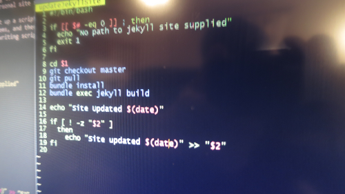

One major down side to using a static site generator like [Jekyll][jekyll] is the lack of dynamic updates. CMS tools like [Wordpress][wordpress] allow for scheduling posts for the future which is almost essential for consistent blog posts. So what do you do if you want a static site but also want to schedule posts for the future? Well if you are hosting your site on your own sever then you can easily automate your site update process. In this post I'll be showing you how I schedule posts for my own site. This is a slightly specific usage so your millage my vary but these ideas should be easily adaptable to many situations.



## Preface

Before we get started there are a few things to note. This implementation requires you to be able to build your Jekyll site on your own Linux server. And your site must use some form of version control and be hosted on a repository that you can access such as [Git][git] and [GitHub.com][github]. As long as you meet those conditions then this process should work for you.

For this implementation we are going to be using cron to automate the updating of our site repository, updating of our ruby gems, building our Jekyll site, and then copying your Jekyll site to push it live. This is based on my own personal site so your implementation may vary but these techniques should be transferable to any self hosted Jekyll site.

## Site Update Script

The first thing we need to do is set up a script to actually update and build our Jekyll site. I've written a script that moves into my Jekyll site folder, checkouts out the master git branch, pulls from that branch, updates my ruby gems, and then builds my Jekyll site. When running the script I just pass it the path to my Jekyll site folder and if I want I can pass it a log file to put stuff in. I have all of the following code in a file called "updateJekyllSite". I'm not really experience with writing bash scripts but this seems to do that job.

```bash
#!/bin/bash

if [[ $# -eq 0]] ; then
    echo "No path to Jekyll site supplied"
    exit 1
fi

cd $1
git checkout master
git pull
bundle install
bundle exec Jekyll build

echo "Site at $1 updated $(date)"

if [ ! -z "$2" ]
    then
    echo "Site at $1 updated $(date)" >> "$2"
fi

```

The first if statement just checks that at least 1 argument was supplied. If no arguments are supplied it outputs that you should supply a Jekyll path and exits the script. Then we cd into the supplied path, call our git calls to update the repo, and then call the bundle commands to update the ruby gems and build the Jekyll site. Finally we output that the site was updated and at what time it was updated. It checks to see if a second argument was supplied and then writes that the site was updated to the supplied file.

## Cron Scheduling

Now that we have a way to update the site we need to schedule our sever to call that script. To do this we'll use a handy software that comes with Ubuntu called [Cron][cron]. [Cron][cron] is a time-based job scheduler that we can use to schedule tasks. I'll only be showing you how I use cron so if you want more info there's a nice guide on the [Ubuntu help documentation][cronGuide]. Before we setup our cron it's important to know that you should run the following commands as the user you want the script to be ran as. So if you want to run your build script as sudo then make sure to run the commands as sudo. To set up cron to run our script you need to type this into your terminal...

```bash
crontab -e
```

This will bring up cron in what ever is your default editor. You should see a little bit of text that explains how the cronrab file works. Each line of the crontab file will run a command. The lines are formated as "Minute Hour Day Month Weekday Command". So if you want to run something everyday at 3:45 p.m. you would type...

```bash
45 15 * * * 'your command here'
```

The astrix(*) denotes that you should use every instance. So this says run the command at 45 minutes on hour 15 of every day of every month. I have my site update script set to run at 6:30 a.m. everyday. So to call our scripts you just add this line to the end of your crontab file...

```bash
30 6 * * * sh path_to_script path_to_Jekyll_site path_to_log_file
```

Obviously you should put the correct paths in your crontab. But this will cause our Jekyll site update script to run everyday. There is one problem I ran into while using cron. I had to setup the path in my crontab file so that the bundle function could actually be called. You can set your crontab path yourself by adding a "PATH=" line to your crontab. If you are using [RVM][rvm] for your ruby management then you can just run the following command...

```bash
rvm cron setup
```

This command will let rvm setup the path inside your crontab file for you. One more thing I added to my crontab file was a "MAILTO='my_email'" line. This makes cron email me a log every time my crontab script is ran. It's super helpful to see when things fail while updating your site.

Now that your site is updated we need to copy it to the correct file that your sever serves the html files from. For me this is as simple as setting up a cron command to call cp 'my_Jekyll_folder'/_site/* 'my_html_folder'. For me I have to run this as sudo so I have to run the 'sudo crontab -e' to allow from cron to use sudo. I have this scheduled for 30 minutes after my site updates just so that if my site takes a while to process it should be ready by the time I push it live.

## Setting Up Jekyll

There's one last thing we have to do to actually allow Jekyll to schedule posts. By default Jekyll builds all posts in your _posts file even if they would occur in the future. However, you can turn this feature off by adding the line 'future: false' in your _config.yml file. This stops Jekyll from building posts that are dated to happen in the future. So now you can type up a post with a future date, push it to your git repo, and let your sever actually push it live when the time comes. The one down side to this method is that you can only schedule posts for specific days not specific times. But other than that this method has worked out nicely for me. I can now write out a few posts and schedule them to post a few days apart. If you have any questions or tips for me feel free to leave a comment and as always thanks for reading!

[jekyll]: http://jekyllrb.com/
[wordpress]: https://wordpress.com/
[git]: https://git-scm.com/
[github]: https://github.com/
[cron]: https://www.wikiwand.com/en/Cron
[cronGuide]: https://help.ubuntu.com/community/CronHowto