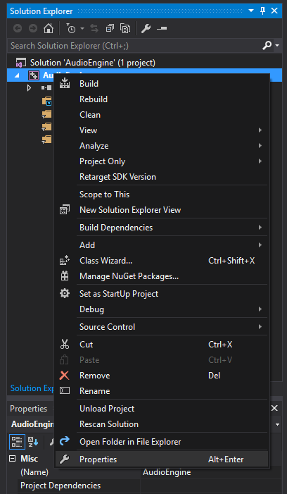
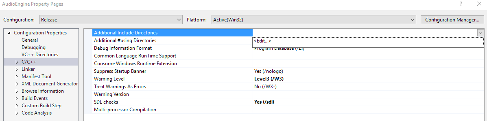
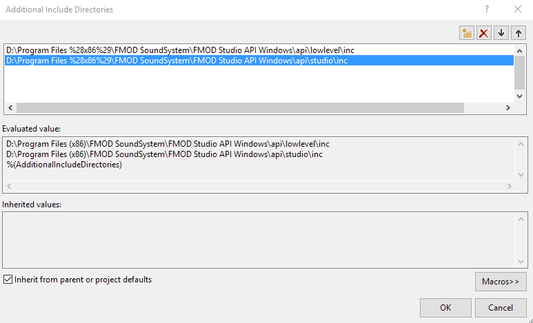
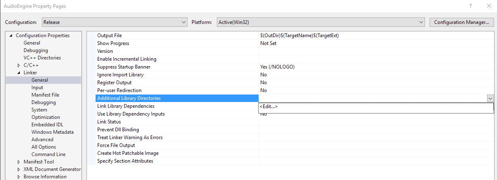
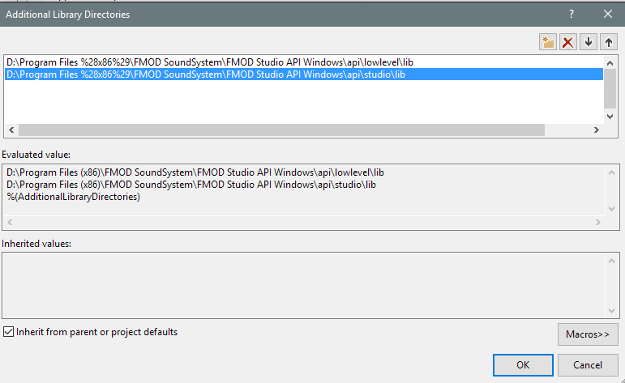
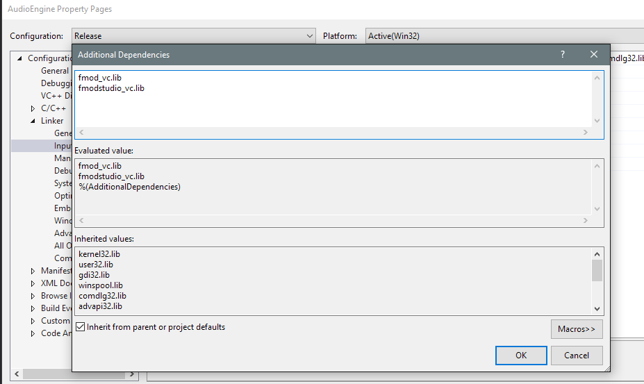
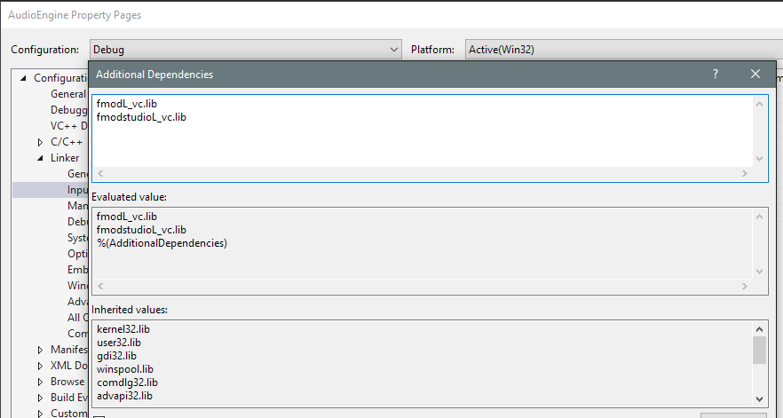
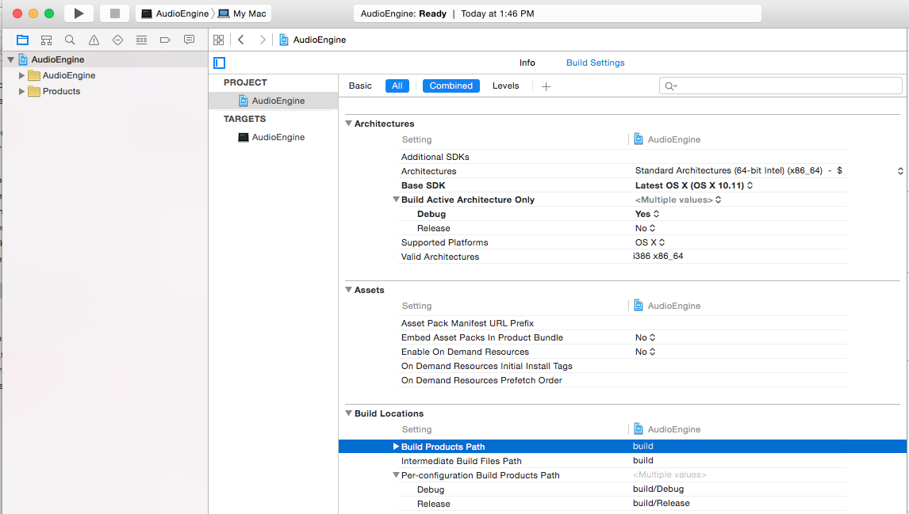
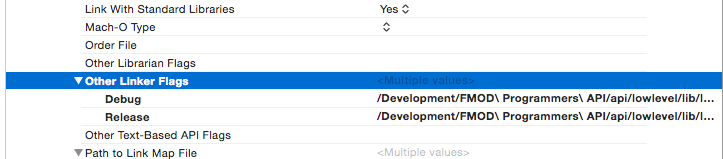
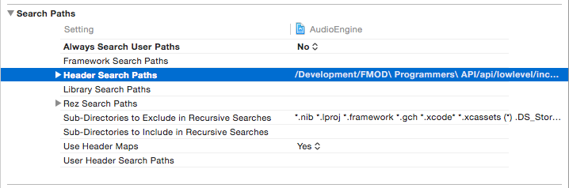

This tutorial series is going to be all about starting out as an Audio Programmer using the middleware [FMOD](http://www.fmod.org/). I'll be going over setting up Xcode/Visual Studio to work with FMOD and creating a basic implementation that you can use in your C++ projects. It's probably good that you have some understanding of C++ but I'll only be covering very basic things so it shouldn't be too hard to follow along if you don't. By the end hopefully you'll have a better grasp on integrating audio middleware into C++ projects so you can start creating some awesome audio programming systems.

I will say this isn't a tutorial on how to use [FMOD Studio](http://www.fmod.org/products/). While you'll be able to use FMOD Studio events with this audio engine, this tutorial is solely concentrating on the programming side of FMOD. If you want a good tutorial on FMOD Studio you should check out the tutorial series from my friend Chris Prunotto over on his site [SoundGuyChris.com](http://blog.soundguychris.com/2014/04/15/an-introduction-to-fmod-part-1/).

## Introduction

For the longest time I've loved both programming and audio so it's only natural that I wanted to delve into the world of audio programming. There's just one problem though... there's a total of about 0 sources on getting into audio programming. I didn't have a background in C++ so reading the API and looking at examples provided by FMOD never really helped me. Every now and then I'd do a new search and look for some beginning tutorials on how to implement FMOD Studio into a game but all that every came up was tools to integrate into [Unity](https://unity3d.com/) or another big engine. And while this is all good and everything for people using those tools I wanted to understand integration at a more basic level.

Luckily in early 2015 I was lucky enough to get access to the [GDC Vault](http://www.gdcvault.com/) which is a collection of almost all the talks given at each Game Developers Conference. Inside the vault there was a talk given by Guy Somberg, who at that time was working at [Telltale Games](https://www.telltalegames.com/), about creating a basic audio engine. This was exactly what I needed to get my start in the audio programming world. A lot of this tutorial is based off his talk at GDC but from my prospective of coming from almost knowing nothing about C++. Hopefully this will be the tutorial that helps others get started creating cool audio programming things.

## Downloading

The first thing you'll have to do is download the FMOD Studio Programmer API for which ever platform you plan to work on. For this tutorial I'm going to go over setting up your environment for both Xcode on OS X and Visual Studio on Windows. The one down side to using FMOD is that you have to sign-up for their site to download the programmer API though it's still free to use for non-commercial/educational use [(and free for commercial use if you are an indie company.)](http://www.fmod.org/sales/)

So go to the [FMOD.org](http://www.fmod.org/download/) and click the downloads tab. If you scroll down past the FMOD Studio Authoring Tool you'll see the FMOD Studio Programmer's API and Low Level Programmer API. Click the Log In/Register button if you haven't signed in yet and it will take you to the sign in/up page. Once that's done head back to the [downloads page](http://www.fmod.org/download/) and get the version that's right for you. I'll be referring to both the Windows and Macintosh versions for this tutorial.

## Installation

The installation is fairly easy and simple for both platforms. Just open either the .exe or .dmg and follow the steps on the screen. What is being installed are the libraries, headers, documentation, and examples of the API. Do remember where you end up installing the files though because we will be referring back to them later. We'll need to link our projects against the libraries and include the headers in our projects. Once we get through this and get everything working I do recommend looking at the examples because they can provide insight and ideas on how to utilize the FMOD API. And when you are working with FMOD the API documentation will at least list the function calls and variables and does explain some (but not all) things going on. Now that we've got everything installed let's look at the steps we need to take for Visual Studio and Xcode to actually use FMOD.

## Visual Studio

I'm going to be starting on a blank project but you can easily add these things to an already started project to get FMOD going. If you are on OS X just go ahead and skip to the Xcode section unless you are planning on possible working on both systems while developing.

So go ahead and either start a new project or open up and existing project that you want to add FMOD functionality to. Adding FMOD to your projects is actually quite easy and you really only need to take two steps to get things working. So to get the FMOD API to be recognized by our project we need to both include the header files and link the libraries. Both of these things are done by opening up the projects properties. To do this in visual studio just right-click on your project and the last option in the drop down menu should be properties.



Once you have the properties window open the first thing we'll want to do is click on the **C/C++** tab under **Configuration Properties**. (If you've started a new project and don't see a **C/C++** tab you just need to create a new .cpp file inside your project first.) Inside this tab the first option to your right should be **Additional Include Directories**. Here is where we are going to tell Visual Studio where the FMOD header files are located. So hover over the input field next to that option, click the arrow to the right, and select edit.



In this window we are going to set the paths to both the FMOD Studio and Low-Level API include files. This can be done by either double-clicking in the window and typing in your location or clicking the little three dot button to open a file browser. Our first line is going to be the FMOD Low-Level include folder. This is located where ever you installed the FMOD API. It's typically located in **C:\Program Files (x86)\FMOD SoundSystem\FMOD Studio API Windows\api\lowlevel\inc** though yours might be a little different. Now you can click bellow that entry and select the path for the FMOD Studio includes which is normally at **C:\Program Files (x86)\FMOD SoundSystem\FMOD Studio API Windows\api\studio\inc**. That's it for the includes. Here's what mine looks like...



Next we need to link the libraries for both FMOD Studio and Low-Level. This is done in two steps. We need to first tell Visual Studio where the files are located, then what files to use. The location option is under **Configuration Properties** -> **Linker** -> **General**. In the window for this tab you should see an option called **Additional Library Directories**. Click the arrow to the right of the input field just like the additional includes to pull up the library directories window.



In this window we'll add the FMOD Studio and Low-Level libraries folders just like the include folders. The paths are normally **C:\Program Files (x86)\FMOD SoundSystem\FMOD Studio API Windows\api\lowlevel\lib** and **C:\Program Files (x86)\FMOD SoundSystem\FMOD Studio API Windows\api\studio\lib**. Here's what mine looks like afterwards.



For the final step in linking we need to tell Visual Studio exactly what files to use. This option is found in **Configuration Properties** -> **Linker** -> **Input**. The first option and the one we need is **Additional Dependencies**. Now this can vary from the Release version and the Debug version.  To change what version you are modifying you can click the drop down menu next to **Configuration** at the top of the window. I'll start with the release version. Open up the **Additional Dependencies** window just like the past two directories windows. The two files we need are **fmod_vc.lib** and **fmodstudio_vc.lib**. Make sure to add these two on separate lines in the window. Click OK and switch to the debug version of the project. The files we need to add here are **fmodL_vc.lib** and **fmodstudioL_vc.lib**. Here's what my Release and Debug version look like.

Release


Debug


And that's really it for setting up Visual Studio. You'll now be able to create your own audio engine using FMOD. One extra little thing I like to do is add a **Post-Build Event** that copies over the libraries need to run the .exe when I build the project. The commands I use are...

```bash

xcopy /y /d "(Path-To-Libraries )\*.dll" "$(OutDir)"

```

## Xcode

For this tutorial I'm going to be starting with a new project but you can easily use these steps to integrate the FMOD API into your own current project. So I'm going to create a new blank C++ project in Xcode to work off. OS X actually makes integrating FMOD super easy. We only need to go add two settings which are for header and libraries. To find these settings you just need to click on your project then click on **Build Settings**  which will bring up the build options window.



The first setting we are looking for is **Other Linking Flags**. You can scroll down to the **Linking** section or just type it in the search bar near the top of the window. Once you find it click the little down arrow next to the option. This will show the Release and Debug options which will be different for FMOD. For the Debug version we'll want to add two different files. We need to add **libfmodL.dylib** and **libfmodstudioL.dylib**. Mine are located at **/Development/FMOD Programmers API/api/lowlevel/lib** and **/Development/FMOD Programmers API/api/studio/lib** but yours will be where ever you installed the API. For the Release setting the files are in the same location but you'll want to use **libfmodstudio.dylib** and **libfmod.dylib**. This is what the settings should look like...



The next option we'll change is **Header Search Paths**. Unlike the library linking this option is the same for both the release and debug version. You can find the settings either by searching for it or finding it under the **Search Paths** section. The paths we'll want to add are the locations of the header files for FMOD. For me these are located at **/Development/FMOD Programmers API/api/lowlevel/inc/** and **/Development/FMOD Programmers API/api/studio/inc/** but yours might be in a different location. You settings should look like this...



And at this point you can use the FMOD API in your project now. Do note though to get your project to actually run you'll need to have the FMOD libraries in the same location as the application.

## Conclusion

Now you can build your own audio engine using FMOD. In the next tutorial I'll go over creating a basic implementation that uses both programmer sounds (single sound files) and FMOD events.
